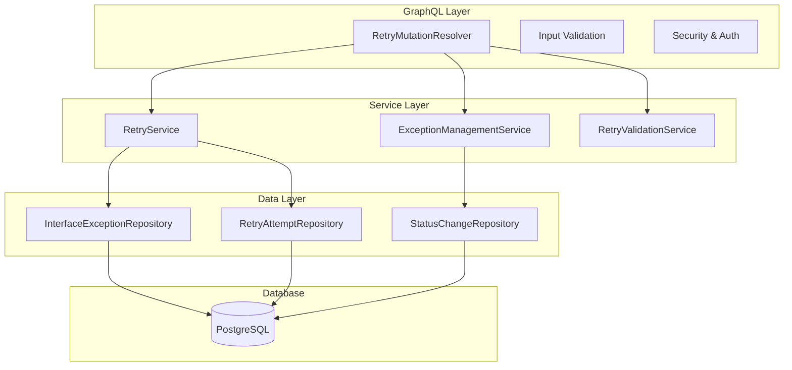

# GraphQL Retry Mutations Design Document

## Overview

This document outlines the design for enhancing the existing GraphQL retry mutations in the Interface Exception Collector Service. The current implementation already provides comprehensive retry, acknowledge, resolve, and cancel retry operations. This enhancement focuses on simplifying the mutations, improving performance, and ensuring they remain database-driven without complex dependencies like Redis.

The design builds upon the existing GraphQL infrastructure and maintains consistency with the current REST API endpoints by using the same underlying service layer.

## Architecture

### Current Architecture Overview

The existing GraphQL implementation follows a clean architecture pattern:



### Enhanced Mutation Design

The enhanced design focuses on four core mutations with simplified interfaces:

#### 1. Retry Exception Mutation

**Current Implementation:**
```graphql
type Mutation {
    retryException(input: RetryExceptionInput!): RetryExceptionResult!
}

input RetryExceptionInput {
    transactionId: String!
    reason: String!
    priority: RetryPriority
    notes: String
}
```

**Enhancement Focus:**
- Simplified validation logic
- Improved error handling with specific error codes
- Optimized database queries
- Enhanced audit logging

#### 2. Acknowledge Exception Mutation

**Current Implementation:**
```graphql
type Mutation {
    acknowledgeException(input: AcknowledgeExceptionInput!): AcknowledgeExceptionResult!
}

input AcknowledgeExceptionInput {
    transactionId: String!
    reason: String!
    notes: String
    estimatedResolutionTime: DateTime
    assignedTo: String
}
```

**Enhancement Focus:**
- Streamlined acknowledgment process
- Better validation for business rules
- Improved status transition handling

#### 3. Resolve Exception Mutation

**Current Implementation:**
```graphql
type Mutation {
    resolveException(input: ResolveExceptionInput!): ResolveExceptionResult!
}

input ResolveExceptionInput {
    transactionId: String!
    resolutionMethod: ResolutionMethod!
    resolutionNotes: String
}
```

**Enhancement Focus:**
- Simplified resolution methods
- Enhanced validation for resolution states
- Better integration with audit trail

#### 4. Cancel Retry Mutation

**Current Implementation:**
```graphql
type Mutation {
    cancelRetry(transactionId: String!, reason: String!): CancelRetryResult!
}
```

**Enhancement Focus:**
- Improved cancellation logic
- Better handling of concurrent operations
- Enhanced error reporting

## Components and Interfaces

### 1. Enhanced Mutation Resolver

The existing `RetryMutationResolver` will be enhanced with:

```java
@Controller
@RequiredArgsConstructor
@Slf4j
public class RetryMutationResolver {
    
    private final RetryService retryService;
    private final ExceptionManagementService exceptionManagementService;
    private final RetryValidationService validationService;
    private final SecurityAuditLogger auditLogger;
    
    @MutationMapping
    @PreAuthorize("hasRole('OPERATIONS') or hasRole('ADMIN')")
    public CompletableFuture<RetryExceptionResult> retryException(
            @Argument @Valid RetryExceptionInput input,
            Authentication authentication) {
        
        return CompletableFuture.supplyAsync(() -> {
            // Enhanced validation
            ValidationResult validation = validationService.validateRetryOperation(input);
            if (!validation.isValid()) {
                return RetryExceptionResult.failure(validation.getErrors());
            }
            
            // Audit logging
            auditLogger.logRetryAttempt(input.getTransactionId(), authentication.getName());
            
            // Execute retry with enhanced error handling
            return executeRetryWithErrorHandling(input, authentication);
        });
    }
}
```

### 2. Enhanced Validation Service

```java
@Service
public class RetryValidationService {
    
    public ValidationResult validateRetryOperation(RetryExceptionInput input) {
        List<GraphQLError> errors = new ArrayList<>();
        
        // Validate transaction ID format
        if (!isValidTransactionId(input.getTransactionId())) {
            errors.add(createValidationError("INVALID_TRANSACTION_ID", 
                "Transaction ID format is invalid"));
        }
        
        // Validate exception exists and is retryable
        Optional<InterfaceException> exception = findException(input.getTransactionId());
        if (exception.isEmpty()) {
            errors.add(createValidationError("EXCEPTION_NOT_FOUND", 
                "Exception not found"));
        } else if (!exception.get().isRetryable()) {
            errors.add(createValidationError("NOT_RETRYABLE", 
                "Exception is not retryable"));
        }
        
        // Validate retry limits
        if (exception.isPresent() && hasExceededRetryLimit(exception.get())) {
            errors.add(createValidationError("RETRY_LIMIT_EXCEEDED", 
                "Maximum retry attempts exceeded"));
        }
        
        return ValidationResult.builder()
            .valid(errors.isEmpty())
            .errors(errors)
            .build();
    }
}
```

### 3. Enhanced Error Handling

```java
public class GraphQLErrorHandler {
    
    public static GraphQLError createBusinessRuleError(String code, String message) {
        return GraphQLError.builder()
            .message(message)
            .code(ErrorCode.BUSINESS_RULE_ERROR)
            .extensions(Map.of(
                "errorCode", code,
                "timestamp", Instant.now(),
                "category", "BUSINESS_VALIDATION"
            ))
            .build();
    }
    
    public static GraphQLError createValidationError(String field, String message) {
        return GraphQLError.builder()
            .message(message)
            .code(ErrorCode.VALIDATION_ERROR)
            .path(List.of(field))
            .extensions(Map.of(
                "field", field,
                "timestamp", Instant.now(),
                "category", "INPUT_VALIDATION"
            ))
            .build();
    }
}
```

## Data Models

### Enhanced Result Types

The existing result types will be enhanced with better error categorization:

```java
@Data
@Builder
public class RetryExceptionResult {
    private boolean success;
    private InterfaceException exception;
    private RetryAttempt retryAttempt;
    private List<GraphQLError> errors;
    
    // Enhanced metadata
    private String operationId;
    private Instant timestamp;
    private String performedBy;
    
    public static RetryExceptionResult success(InterfaceException exception, 
                                             RetryAttempt attempt, 
                                             String operationId,
                                             String performedBy) {
        return RetryExceptionResult.builder()
            .success(true)
            .exception(exception)
            .retryAttempt(attempt)
            .operationId(operationId)
            .timestamp(Instant.now())
            .performedBy(performedBy)
            .errors(List.of())
            .build();
    }
}
```

### Database Schema Enhancements

The existing database schema supports all required operations. Minor enhancements for audit logging:

```sql
-- Enhanced audit logging table
CREATE TABLE IF NOT EXISTS mutation_audit_log (
    id BIGSERIAL PRIMARY KEY,
    operation_type VARCHAR(50) NOT NULL,
    transaction_id VARCHAR(255) NOT NULL,
    performed_by VARCHAR(255) NOT NULL,
    performed_at TIMESTAMP WITH TIME ZONE DEFAULT NOW(),
    input_data JSONB,
    result_status VARCHAR(20) NOT NULL,
    error_details JSONB,
    execution_time_ms INTEGER,
    
    INDEX idx_audit_transaction_id (transaction_id),
    INDEX idx_audit_performed_by (performed_by),
    INDEX idx_audit_performed_at (performed_at)
);
```

## Security Design

### Enhanced Authentication & Authorization

The existing security model will be enhanced with operation-specific permissions:

```java
@Configuration
public class GraphQLSecurityEnhancements {
    
    @PreAuthorize("hasRole('OPERATIONS') and @securityService.canRetry(#input.transactionId, authentication)")
    public CompletableFuture<RetryExceptionResult> retryException(
            RetryExceptionInput input, Authentication authentication) {
        // Implementation
    }
    
    @PreAuthorize("hasRole('OPERATIONS') and @securityService.canAcknowledge(#input.transactionId, authentication)")
    public CompletableFuture<AcknowledgeExceptionResult> acknowledgeException(
            AcknowledgeExceptionInput input, Authentication authentication) {
        // Implementation
    }
}
```

### Audit Trail Enhancement

```java
@Component
public class SecurityAuditLogger {
    
    public void logMutationAttempt(String operation, String transactionId, 
                                  String userId, Object input) {
        AuditEvent event = AuditEvent.builder()
            .operation(operation)
            .transactionId(transactionId)
            .userId(userId)
            .timestamp(Instant.now())
            .inputData(serializeInput(input))
            .build();
            
        auditRepository.save(event);
    }
    
    public void logMutationResult(String operationId, boolean success, 
                                 List<GraphQLError> errors) {
        // Log operation result for compliance
    }
}
```

## Performance Optimization

### Database Query Optimization

Enhanced queries for better performance:

```java
@Repository
public class OptimizedExceptionRepository {
    
    @Query("""
        SELECT e FROM InterfaceException e 
        LEFT JOIN FETCH e.retryAttempts ra 
        WHERE e.transactionId = :transactionId 
        AND e.status IN :retryableStatuses
        """)
    Optional<InterfaceException> findRetryableException(
        @Param("transactionId") String transactionId,
        @Param("retryableStatuses") List<ExceptionStatus> statuses);
    
    @Query("""
        SELECT COUNT(ra) FROM RetryAttempt ra 
        WHERE ra.interfaceException.transactionId = :transactionId 
        AND ra.status = 'PENDING'
        """)
    int countPendingRetries(@Param("transactionId") String transactionId);
}
```

### Caching Strategy (Database-Only)

Simple database-level caching without Redis dependency:

```java
@Service
public class DatabaseCachingService {
    
    @Cacheable(value = "exception-validation", key = "#transactionId")
    public ValidationResult validateExceptionForRetry(String transactionId) {
        // Cache validation results in application memory
        return performValidation(transactionId);
    }
    
    @CacheEvict(value = "exception-validation", key = "#transactionId")
    public void invalidateValidationCache(String transactionId) {
        // Clear cache when exception status changes
    }
}
```

## Error Handling

### Enhanced Error Classification

```java
public enum MutationErrorCode {
    // Validation Errors
    INVALID_TRANSACTION_ID("VALIDATION_001", "Invalid transaction ID format"),
    MISSING_REQUIRED_FIELD("VALIDATION_002", "Required field is missing"),
    INVALID_FIELD_VALUE("VALIDATION_003", "Field value is invalid"),
    
    // Business Rule Errors
    EXCEPTION_NOT_FOUND("BUSINESS_001", "Exception not found"),
    NOT_RETRYABLE("BUSINESS_002", "Exception is not retryable"),
    RETRY_LIMIT_EXCEEDED("BUSINESS_003", "Maximum retry attempts exceeded"),
    INVALID_STATUS_TRANSITION("BUSINESS_004", "Invalid status transition"),
    
    // System Errors
    DATABASE_ERROR("SYSTEM_001", "Database operation failed"),
    EXTERNAL_SERVICE_ERROR("SYSTEM_002", "External service unavailable"),
    CONCURRENT_MODIFICATION("SYSTEM_003", "Concurrent modification detected");
    
    private final String code;
    private final String defaultMessage;
}
```

### Structured Error Response

```java
@Data
@Builder
public class GraphQLError {
    private String message;
    private ErrorCode code;
    private List<String> path;
    private Map<String, Object> extensions;
    
    public static GraphQLError businessRule(MutationErrorCode errorCode, String details) {
        return GraphQLError.builder()
            .message(errorCode.getDefaultMessage() + ": " + details)
            .code(ErrorCode.BUSINESS_RULE_ERROR)
            .extensions(Map.of(
                "errorCode", errorCode.getCode(),
                "category", "BUSINESS_RULE",
                "retryable", false
            ))
            .build();
    }
}
```

## Real-time Updates

### Enhanced Subscription Integration

The existing subscription system will be enhanced to provide real-time updates for mutation results:

```java
@Component
public class MutationEventPublisher {
    
    @EventListener
    public void handleRetryCompleted(RetryCompletedEvent event) {
        ExceptionUpdateEvent updateEvent = ExceptionUpdateEvent.builder()
            .eventType(ExceptionEventType.RETRY_COMPLETED)
            .exception(event.getException())
            .timestamp(Instant.now())
            .triggeredBy(event.getInitiatedBy())
            .build();
            
        subscriptionPublisher.publishUpdate(updateEvent);
    }
    
    @EventListener
    public void handleExceptionResolved(ExceptionResolvedEvent event) {
        // Publish resolution updates
    }
}
```

## Integration Points

### Service Layer Integration

The mutations integrate with existing services without modification:

```java
@Service
public class RetryService {
    
    // Existing method - no changes needed
    public RetryResponse initiateRetry(String transactionId, RetryRequest request) {
        // Current implementation remains unchanged
    }
    
    // Enhanced method for GraphQL-specific needs
    public RetryResult initiateRetryWithValidation(String transactionId, 
                                                  RetryRequest request) {
        // Additional validation and error handling for GraphQL
        ValidationResult validation = validateRetryRequest(transactionId, request);
        if (!validation.isValid()) {
            return RetryResult.failure(validation.getErrors());
        }
        
        return executeRetry(transactionId, request);
    }
}
```

## Monitoring and Observability

### Enhanced Metrics Collection

```java
@Component
public class MutationMetrics {
    
    private final Counter mutationCounter = Counter.builder("graphql.mutation.count")
        .tag("type", "retry_operations")
        .register(Metrics.globalRegistry);
        
    private final Timer mutationTimer = Timer.builder("graphql.mutation.duration")
        .register(Metrics.globalRegistry);
    
    @EventListener
    public void onMutationExecution(MutationExecutionEvent event) {
        mutationCounter.increment(
            Tags.of(
                "operation", event.getOperationType(),
                "status", event.isSuccess() ? "success" : "error",
                "user", event.getUserId()
            )
        );
        
        mutationTimer.record(event.getDuration(), TimeUnit.MILLISECONDS);
    }
}
```

### Health Checks

```java
@Component
public class MutationHealthIndicator implements HealthIndicator {
    
    @Override
    public Health health() {
        try {
            // Test mutation capabilities
            boolean canRetry = retryService.isRetryServiceHealthy();
            boolean canAcknowledge = exceptionService.isAcknowledgmentServiceHealthy();
            
            if (canRetry && canAcknowledge) {
                return Health.up()
                    .withDetail("retry_service", "operational")
                    .withDetail("acknowledgment_service", "operational")
                    .build();
            } else {
                return Health.down()
                    .withDetail("retry_service", canRetry ? "operational" : "degraded")
                    .withDetail("acknowledgment_service", canAcknowledge ? "operational" : "degraded")
                    .build();
            }
        } catch (Exception e) {
            return Health.down()
                .withDetail("error", e.getMessage())
                .build();
        }
    }
}
```

## Testing Strategy

### Unit Testing Enhancements

```java
@ExtendWith(MockitoExtension.class)
class RetryMutationResolverTest {
    
    @Mock
    private RetryService retryService;
    
    @Mock
    private RetryValidationService validationService;
    
    @InjectMocks
    private RetryMutationResolver resolver;
    
    @Test
    void retryException_WithValidInput_ShouldReturnSuccess() {
        // Given
        RetryExceptionInput input = RetryExceptionInput.builder()
            .transactionId("TXN-123")
            .reason("System error resolved")
            .priority(RetryPriority.NORMAL)
            .build();
            
        when(validationService.validateRetryOperation(input))
            .thenReturn(ValidationResult.valid());
            
        // When & Then
        CompletableFuture<RetryExceptionResult> result = resolver.retryException(input, mockAuth);
        
        assertThat(result.join().isSuccess()).isTrue();
        verify(retryService).initiateRetry(eq("TXN-123"), any(RetryRequest.class));
    }
}
```

### Integration Testing

```java
@GraphQlTest
@TestPropertySource(properties = {
    "spring.datasource.url=jdbc:h2:mem:testdb",
    "spring.jpa.hibernate.ddl-auto=create-drop"
})
class RetryMutationIntegrationTest {
    
    @Autowired
    private GraphQlTester graphQlTester;
    
    @Test
    void retryException_EndToEnd_ShouldWork() {
        String mutation = """
            mutation RetryException($input: RetryExceptionInput!) {
                retryException(input: $input) {
                    success
                    exception {
                        transactionId
                        status
                    }
                    errors {
                        message
                        code
                    }
                }
            }
            """;
            
        graphQlTester.document(mutation)
            .variable("input", Map.of(
                "transactionId", "TXN-123",
                "reason", "Test retry",
                "priority", "NORMAL"
            ))
            .execute()
            .path("retryException.success")
            .entity(Boolean.class)
            .isEqualTo(true);
    }
}
```

## Deployment Considerations

### Configuration

```yaml
# Enhanced GraphQL Configuration
spring:
  graphql:
    mutation:
      timeout: 30s
      max-concurrent-operations: 100
    validation:
      enabled: true
      fail-fast: true
    
# Audit Configuration
audit:
  mutation-logging:
    enabled: true
    include-input-data: true
    retention-days: 90

# Performance Configuration
performance:
  database:
    query-timeout: 10s
    connection-pool-size: 20
  caching:
    validation-cache-ttl: 300s
    exception-cache-ttl: 60s
```

### Production Hardening

- Enhanced input validation with custom validators
- Rate limiting per user for mutation operations
- Comprehensive audit logging for compliance
- Circuit breaker patterns for external service calls
- Graceful degradation when services are unavailable

This design maintains the existing robust GraphQL implementation while focusing on simplicity, performance, and reliability. The enhancements build upon the current foundation without introducing complex dependencies, keeping the system maintainable and performant.