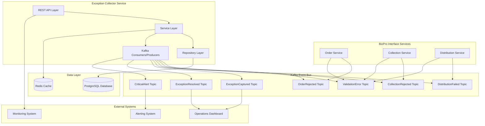

# Design Document

## Overview

The Interface Exception Collector Service is an event-driven microservice that centralizes the collection, storage, and management of exception events from BioPro interface services (Order, Collection, Distribution). The system provides real-time exception processing, retry capabilities, comprehensive search and filtering, and operational dashboards for monitoring interface health.

### Key Design Principles

- **Event-Driven Architecture**: Asynchronous processing of exception events via Kafka
- **Resilience**: Graceful handling of failures with retry mechanisms and circuit breakers
- **Observability**: Comprehensive logging, metrics, and health monitoring
- **Scalability**: Horizontal scaling through stateless design and partitioned Kafka topics
- **Data Consistency**: ACID transactions for critical operations with eventual consistency for events

## Architecture

### High-Level Architecture



### Service Architecture

The service follows a layered architecture pattern:

1. **API Layer**: REST endpoints for external access
2. **Service Layer**: Business logic and orchestration
3. **Repository Layer**: Data access abstraction
4. **Event Layer**: Kafka message processing
5. **Infrastructure Layer**: Cross-cutting concerns (security, monitoring, caching)

## Components and Interfaces

### 1. Kafka Event Consumers

#### Exception Event Processors
- **OrderExceptionConsumer**: Processes OrderRejected and OrderCancelled events
- **CollectionExceptionConsumer**: Handles CollectionRejected events
- **DistributionExceptionConsumer**: Processes DistributionFailed events
- **ValidationErrorConsumer**: Handles ValidationError events from all services

**Key Features**:
- Consumer group: `interface-exception-collector`
- Parallel processing with 3 partitions per topic
- Dead letter queue for failed message processing
- Idempotent processing using transaction IDs
- Exponential backoff retry with circuit breaker

#### Event Publishers
- **ExceptionEventPublisher**: Publishes ExceptionCaptured, ExceptionResolved events
- **AlertPublisher**: Sends CriticalExceptionAlert events
- **RetryEventPublisher**: Publishes ExceptionRetryCompleted events

### 2. REST API Controllers

#### ExceptionController
- `GET /api/v1/exceptions` - List exceptions with filtering and pagination
- `GET /api/v1/exceptions/{transactionId}` - Get detailed exception information
- `GET /api/v1/exceptions/search` - Full-text search across exceptions
- `GET /api/v1/exceptions/summary` - Aggregated statistics

#### RetryController
- `POST /api/v1/exceptions/{transactionId}/retry` - Initiate retry operation
- `GET /api/v1/exceptions/{transactionId}/retry-history` - Get retry history

#### ManagementController
- `PUT /api/v1/exceptions/{transactionId}/acknowledge` - Acknowledge exception
- `PUT /api/v1/exceptions/{transactionId}/resolve` - Mark as resolved

### 3. Service Layer Components

#### ExceptionProcessingService
- Processes inbound exception events
- Applies business rules for categorization and severity assignment
- Manages exception lifecycle state transitions
- Triggers critical alerts based on severity and patterns

#### RetryService
- Orchestrates retry operations
- Retrieves original payloads from source services
- Manages retry attempts and history tracking
- Updates exception status based on retry outcomes

#### PayloadRetrievalService
- Fetches original request payloads from source interface services
- Implements circuit breaker pattern for external service calls
- Caches frequently accessed payloads
- Handles service unavailability gracefully

#### AlertingService
- Evaluates exceptions for critical alert conditions
- Publishes alerts to appropriate channels
- Manages escalation rules and team assignments
- Tracks alert acknowledgment and resolution

### 4. Repository Layer

#### InterfaceExceptionRepository
- CRUD operations for exception entities
- Complex queries with filtering, sorting, and pagination
- Full-text search capabilities using PostgreSQL's text search
- Optimized queries with proper indexing strategy

#### RetryAttemptRepository
- Manages retry attempt records
- Tracks retry history and outcomes
- Supports querying by exception and attempt status

### 5. External Service Integration

#### SourceServiceClient
- HTTP clients for Order, Collection, and Distribution services
- Retrieves original payloads for retry operations
- Implements timeout, retry, and circuit breaker patterns
- Handles authentication and authorization

## Data Models

### Core Entity: InterfaceException

```sql
CREATE TABLE interface_exceptions (
    id BIGSERIAL PRIMARY KEY,
    transaction_id VARCHAR(255) NOT NULL UNIQUE,
    interface_type VARCHAR(50) NOT NULL,
    exception_reason TEXT NOT NULL,
    operation VARCHAR(100) NOT NULL,
    external_id VARCHAR(255),
    status VARCHAR(50) NOT NULL DEFAULT 'NEW',
    severity VARCHAR(50) NOT NULL DEFAULT 'MEDIUM',
    category VARCHAR(50) NOT NULL,
    retryable BOOLEAN NOT NULL DEFAULT true,
    customer_id VARCHAR(255),
    location_code VARCHAR(100),
    timestamp TIMESTAMP WITH TIME ZONE NOT NULL,
    processed_at TIMESTAMP WITH TIME ZONE NOT NULL DEFAULT NOW(),
    acknowledged_at TIMESTAMP WITH TIME ZONE,
    acknowledged_by VARCHAR(255),
    resolved_at TIMESTAMP WITH TIME ZONE,
    resolved_by VARCHAR(255),
    retry_count INTEGER NOT NULL DEFAULT 0,
    last_retry_at TIMESTAMP WITH TIME ZONE,
    created_at TIMESTAMP WITH TIME ZONE NOT NULL DEFAULT NOW(),
    updated_at TIMESTAMP WITH TIME ZONE NOT NULL DEFAULT NOW()
);
```

### Supporting Entity: RetryAttempt

```sql
CREATE TABLE retry_attempts (
    id BIGSERIAL PRIMARY KEY,
    exception_id BIGINT NOT NULL REFERENCES interface_exceptions(id),
    attempt_number INTEGER NOT NULL,
    status VARCHAR(50) NOT NULL DEFAULT 'PENDING',
    initiated_by VARCHAR(255) NOT NULL,
    initiated_at TIMESTAMP WITH TIME ZONE NOT NULL DEFAULT NOW(),
    completed_at TIMESTAMP WITH TIME ZONE,
    result_success BOOLEAN,
    result_message TEXT,
    result_response_code INTEGER,
    result_error_details JSONB,
    UNIQUE(exception_id, attempt_number)
);
```

### Indexes for Performance

```sql
-- Primary lookup indexes
CREATE INDEX idx_interface_exceptions_transaction_id ON interface_exceptions(transaction_id);
CREATE INDEX idx_interface_exceptions_interface_type ON interface_exceptions(interface_type);
CREATE INDEX idx_interface_exceptions_status ON interface_exceptions(status);
CREATE INDEX idx_interface_exceptions_severity ON interface_exceptions(severity);
CREATE INDEX idx_interface_exceptions_customer_id ON interface_exceptions(customer_id);

-- Time-based queries
CREATE INDEX idx_interface_exceptions_timestamp ON interface_exceptions(timestamp DESC);
CREATE INDEX idx_interface_exceptions_processed_at ON interface_exceptions(processed_at DESC);

-- Composite indexes for common filter combinations
CREATE INDEX idx_interface_exceptions_type_status ON interface_exceptions(interface_type, status);
CREATE INDEX idx_interface_exceptions_severity_timestamp ON interface_exceptions(severity, timestamp DESC);

-- Full-text search
CREATE INDEX idx_interface_exceptions_reason_fts ON interface_exceptions USING gin(to_tsvector('english', exception_reason));
CREATE INDEX idx_interface_exceptions_external_id_fts ON interface_exceptions USING gin(to_tsvector('english', external_id));
```

### Event Schemas

#### Inbound Event: OrderRejected
```json
{
  "eventId": "uuid",
  "eventType": "OrderRejected",
  "eventVersion": "1.0",
  "occurredOn": "2025-08-04T10:30:00Z",
  "source": "order-service",
  "correlationId": "uuid",
  "payload": {
    "transactionId": "uuid",
    "externalId": "ORDER-ABC123",
    "operation": "CREATE_ORDER",
    "rejectedReason": "Order already exists",
    "customerId": "CUST001",
    "locationCode": "LOC001",
    "orderItems": [...]
  }
}
```

#### Outbound Event: ExceptionCaptured
```json
{
  "eventId": "uuid",
  "eventType": "ExceptionCaptured",
  "eventVersion": "1.0",
  "occurredOn": "2025-08-04T10:30:05Z",
  "source": "exception-collector-service",
  "correlationId": "uuid",
  "payload": {
    "exceptionId": 12345,
    "transactionId": "uuid",
    "interfaceType": "ORDER",
    "severity": "MEDIUM",
    "category": "BUSINESS_RULE",
    "exceptionReason": "Order already exists",
    "customerId": "CUST001",
    "retryable": true
  }
}
```

## Error Handling

### Exception Processing Pipeline

1. **Message Validation**: Schema validation for inbound events
2. **Duplicate Detection**: Check for existing exceptions by transaction ID
3. **Business Rule Application**: Categorization and severity assignment
4. **Database Transaction**: Atomic storage of exception data
5. **Event Publishing**: Asynchronous notification of downstream systems
6. **Error Recovery**: Dead letter queue for failed processing

### Retry Mechanisms

#### Kafka Consumer Retries
- **Immediate Retry**: 3 attempts with 1-second intervals
- **Exponential Backoff**: 5, 10, 20, 40 seconds for transient failures
- **Dead Letter Queue**: Failed messages after max retries
- **Manual Recovery**: Admin interface for DLQ message reprocessing

#### Database Operation Retries
- **Connection Failures**: 5 retries with exponential backoff
- **Deadlock Detection**: Automatic retry with jitter
- **Timeout Handling**: 30-second query timeout with retry

#### External Service Calls
- **Circuit Breaker**: Open after 5 consecutive failures
- **Timeout Configuration**: 5-second request timeout
- **Fallback Behavior**: Return cached data or null payload
- **Health Check**: Periodic service availability verification

### Resilience Patterns

#### Circuit Breaker Implementation
```java
@Component
public class SourceServiceClient {
    
    @CircuitBreaker(name = "source-service", fallbackMethod = "fallbackGetPayload")
    @TimeLimiter(name = "source-service")
    @Retry(name = "source-service")
    public CompletableFuture<PayloadResponse> getOriginalPayload(String transactionId) {
        // HTTP call to source service
    }
    
    public CompletableFuture<PayloadResponse> fallbackGetPayload(String transactionId, Exception ex) {
        return CompletableFuture.completedFuture(null);
    }
}
```

## Testing Strategy

### Unit Testing
- **Service Layer**: Business logic validation with mocked dependencies
- **Repository Layer**: Database operations with TestContainers
- **Event Processing**: Kafka consumer/producer testing with EmbeddedKafka
- **API Layer**: Controller testing with MockMvc

### Integration Testing
- **End-to-End Flows**: Complete exception processing pipeline
- **Database Integration**: Real PostgreSQL with TestContainers
- **Kafka Integration**: Real Kafka cluster with TestContainers
- **External Service Mocking**: WireMock for source service calls

### Performance Testing
- **Load Testing**: High-volume exception processing scenarios
- **Stress Testing**: Resource exhaustion and recovery testing
- **Latency Testing**: Response time validation for API endpoints
- **Throughput Testing**: Kafka message processing capacity

### Test Data Management
- **Test Fixtures**: Predefined exception scenarios
- **Data Builders**: Fluent API for test data creation
- **Database Cleanup**: Transactional rollback for test isolation
- **Kafka Topic Management**: Dedicated test topics with cleanup

## Security Considerations

### Authentication and Authorization
- **JWT Bearer Tokens**: API authentication using Spring Security
- **Role-Based Access**: Operations team vs. read-only access
- **Service-to-Service**: Mutual TLS for Kafka and database connections

### Data Protection
- **PII Handling**: Customer data encryption at rest and in transit
- **Audit Logging**: All data access and modification tracking
- **Data Retention**: Configurable retention policies for exception data
- **Secure Configuration**: External configuration for sensitive values

### Network Security
- **TLS Encryption**: All external communications encrypted
- **Network Segmentation**: Service isolation with proper firewall rules
- **API Rate Limiting**: Protection against abuse and DoS attacks

## Monitoring and Observability

### Application Metrics
- **Exception Processing Rate**: Messages processed per second
- **Error Rates**: Failed processing percentage by interface type
- **Retry Success Rate**: Percentage of successful retry operations
- **API Response Times**: Latency percentiles for REST endpoints

### Business Metrics
- **Exception Volume**: Daily/hourly exception counts by type and severity
- **Resolution Time**: Time from exception capture to resolution
- **Customer Impact**: Exceptions grouped by customer and severity
- **Interface Health**: Exception rates as interface health indicators

### Alerting Rules
- **Critical Exceptions**: Immediate alerts for CRITICAL severity
- **High Error Rates**: Alert when error rate exceeds threshold
- **Service Unavailability**: Alert on external service failures
- **Database Issues**: Connection failures and slow queries

### Logging Strategy
- **Structured Logging**: JSON format with correlation IDs
- **Log Levels**: DEBUG for development, INFO for production
- **Sensitive Data**: Masking of PII in log outputs
- **Log Aggregation**: Centralized logging with ELK stack

## Deployment and Operations

### Container Configuration
- **Base Image**: OpenJDK 21 slim for optimal performance
- **Resource Limits**: CPU and memory constraints for predictable scaling
- **Health Checks**: Liveness and readiness probes
- **Graceful Shutdown**: Proper cleanup of Kafka consumers and database connections

### Environment Configuration
- **Configuration Management**: External configuration via ConfigMaps
- **Secret Management**: Kubernetes secrets for sensitive data
- **Environment Profiles**: Development, staging, and production configurations

### Scaling Strategy
- **Horizontal Scaling**: Multiple service instances with load balancing
- **Kafka Partitioning**: Parallel processing across multiple partitions
- **Database Connection Pooling**: Optimized connection management
- **Caching Strategy**: Redis for frequently accessed data

### Backup and Recovery
- **Database Backups**: Daily automated backups with point-in-time recovery
- **Kafka Topic Retention**: Configurable message retention periods
- **Configuration Backup**: Version-controlled configuration management
- **Disaster Recovery**: Multi-region deployment capabilities