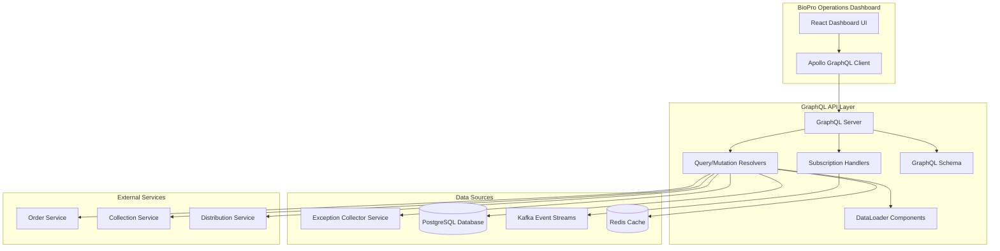

# GraphQL API Design Document

## Interface Exception Collector Service

### Overview

This document outlines the design for implementing GraphQL API capabilities for the Interface Exception Collector Service, providing a modern, flexible query interface for the BioPro Operations Dashboard. The GraphQL API will serve as a unified data layer that enables efficient querying, real-time updates, and operational actions on exception data.

### Architecture Overview

#### High-Level Architecture



#### Technology Stack

- **Spring Boot GraphQL** - Core GraphQL implementation
- **GraphQL Java** - GraphQL execution engine  
- **DataLoader** - Batch loading and caching
- **Spring Security** - JWT authentication and authorization
- **Spring WebFlux** - WebSocket support for subscriptions
- **Redis** - Caching layer
- **Kafka** - Event streaming for real-time updates

### Components and Interfaces

#### 1. GraphQL Schema Layer

The GraphQL schema defines the API contract and type system:

**Core Types:**
```graphql
type Exception {
  id: ID!
  transactionId: String!
  externalId: String
  interfaceType: InterfaceType!
  exceptionReason: String!
  operation: String!
  status: ExceptionStatus!
  severity: ExceptionSeverity!
  category: ExceptionCategory!
  customerId: String
  locationCode: String
  timestamp: DateTime!
  processedAt: DateTime!
  retryable: Boolean!
  retryCount: Int!
  maxRetries: Int!
  lastRetryAt: DateTime
  acknowledgedBy: String
  acknowledgedAt: DateTime
  
  # Nested objects (lazy loaded)
  originalPayload: OriginalPayload
  retryHistory: [RetryAttempt!]!
  statusHistory: [StatusChange!]!
}

type OriginalPayload {
  content: JSON!
  contentType: String!
  retrievedAt: DateTime!
  sourceService: String!
}

type RetryAttempt {
  attemptNumber: Int!
  status: RetryStatus!
  initiatedBy: String!
  initiatedAt: DateTime!
  completedAt: DateTime
  resultSuccess: Boolean
  resultMessage: String
  resultResponseCode: Int
  resultErrorDetails: JSON
}

type ExceptionSummary {
  totalExceptions: Int!
  byInterfaceType: [InterfaceTypeSummary!]!
  bySeverity: [SeveritySummary!]!
  byStatus: [StatusSummary!]!
  trends: [TrendDataPoint!]!
  keyMetrics: KeyMetrics!
}
```

**Input Types:**
```graphql
input ExceptionFilters {
  interfaceTypes: [InterfaceType!]
  statuses: [ExceptionStatus!]
  severities: [ExceptionSeverity!]
  dateRange: DateRangeInput
  customerIds: [String!]
  locationCodes: [String!]
  searchTerm: String
  excludeResolved: Boolean
  retryable: Boolean
}

input PaginationInput {
  first: Int
  after: String
  last: Int
  before: String
}

input SortingInput {
  field: String!
  direction: SortDirection!
}
```

#### 2. Query Resolvers

**Exception List Resolver:**
```java
@Component
public class ExceptionQueryResolver {
    
    @Autowired
    private ExceptionService exceptionService;
    
    @Autowired
    private ExceptionDataLoader exceptionDataLoader;
    
    @QueryMapping
    public CompletableFuture<ExceptionConnection> exceptions(
            @Argument ExceptionFilters filters,
            @Argument PaginationInput pagination,
            @Argument SortingInput sorting,
            DataFetchingEnvironment environment) {
        
        return exceptionService.findExceptions(filters, pagination, sorting)
            .thenApply(this::toConnection);
    }
    
    @QueryMapping
    public CompletableFuture<Exception> exception(@Argument String transactionId) {
        return exceptionDataLoader.load(transactionId);
    }
}
```

**Summary Statistics Resolver:**
```java
@Component
public class SummaryQueryResolver {
    
    @Autowired
    private SummaryService summaryService;
    
    @QueryMapping
    @Cacheable(value = "exception-summary", key = "#filters.hashCode() + '_' + #timeRange")
    public CompletableFuture<ExceptionSummary> exceptionSummary(
            @Argument TimeRange timeRange,
            @Argument ExceptionFilters filters) {
        
        return summaryService.generateSummary(timeRange, filters);
    }
}
```

#### 3. Mutation Resolvers

**Retry Operations:**
```java
@Component
public class RetryMutationResolver {
    
    @Autowired
    private RetryService retryService;
    
    @MutationMapping
    @PreAuthorize("hasRole('OPERATIONS')")
    public CompletableFuture<RetryExceptionResult> retryException(
            @Argument String transactionId,
            @Argument String reason,
            @Argument RetryPriority priority,
            Authentication authentication) {
        
        String userId = authentication.getName();
        return retryService.retryException(transactionId, reason, priority, userId);
    }
    
    @MutationMapping
    @PreAuthorize("hasRole('OPERATIONS')")
    public CompletableFuture<AcknowledgeExceptionResult> acknowledgeException(
            @Argument String transactionId,
            @Argument String reason,
            @Argument String notes,
            Authentication authentication) {
        
        String userId = authentication.getName();
        return retryService.acknowledgeException(transactionId, reason, notes, userId);
    }
}
```

#### 4. Subscription Resolvers

**Real-time Updates:**
```java
@Component
public class ExceptionSubscriptionResolver {
    
    @Autowired
    private ExceptionEventPublisher eventPublisher;
    
    @SubscriptionMapping
    @PreAuthorize("hasRole('VIEWER')")
    public Flux<ExceptionUpdateEvent> exceptionUpdated(
            @Argument ExceptionFilters filters,
            Authentication authentication) {
        
        return eventPublisher.getExceptionUpdates()
            .filter(event -> matchesFilters(event, filters))
            .filter(event -> hasPermission(event, authentication));
    }
}
```

#### 5. DataLoader Implementation

**Exception DataLoader:**
```java
@Component
public class ExceptionDataLoader implements MappedBatchLoader<String, Exception> {
    
    @Autowired
    private ExceptionRepository exceptionRepository;
    
    @Override
    public CompletionStage<Map<String, Exception>> load(Set<String> transactionIds) {
        return CompletableFuture.supplyAsync(() -> {
            List<Exception> exceptions = exceptionRepository.findByTransactionIdIn(transactionIds);
            return exceptions.stream()
                .collect(Collectors.toMap(Exception::getTransactionId, Function.identity()));
        });
    }
}
```

**Payload DataLoader:**
```java
@Component
public class PayloadDataLoader implements MappedBatchLoader<String, OriginalPayload> {
    
    @Autowired
    private PayloadService payloadService;
    
    @Override
    public CompletionStage<Map<String, OriginalPayload>> load(Set<String> transactionIds) {
        return payloadService.batchLoadPayloads(transactionIds);
    }
}
```

### Data Models

#### Database Schema Integration

The GraphQL API will integrate with existing database tables:

- `interface_exceptions` - Main exception data
- `original_payloads` - Cached original request payloads
- `retry_attempts` - Retry history and results
- `exception_events` - Audit trail and status changes
- `exception_summary_mv` - Materialized view for aggregations

#### Caching Strategy

**Redis Cache Patterns:**
```java
@Configuration
public class CacheConfig {
    
    @Bean
    public CacheManager cacheManager(RedisConnectionFactory connectionFactory) {
        RedisCacheConfiguration config = RedisCacheConfiguration.defaultCacheConfig()
            .entryTtl(Duration.ofMinutes(5))
            .serializeKeysWith(RedisSerializationContext.SerializationPair
                .fromSerializer(new StringRedisSerializer()))
            .serializeValuesWith(RedisSerializationContext.SerializationPair
                .fromSerializer(new GenericJackson2JsonRedisSerializer()));
        
        return RedisCacheManager.builder(connectionFactory)
            .cacheDefaults(config)
            .transactionAware()
            .build();
    }
}
```

**Cache Keys:**
- `dashboard:summary:{timeRange}:{filters_hash}` - Dashboard statistics (TTL: 5 minutes)
- `exception:details:{transactionId}` - Exception details (TTL: 1 hour)
- `payload:{transactionId}` - Original payloads (TTL: 24 hours)
- `counters:exceptions:{type}` - Real-time counters (No TTL)

### Security Design

#### Authentication & Authorization

```java
@Configuration
@EnableWebSecurity
public class GraphQLSecurityConfig {
    
    @Bean
    public SecurityFilterChain filterChain(HttpSecurity http) throws Exception {
        return http
            .authorizeHttpRequests(auth -> auth
                .requestMatchers("/graphql").authenticated()
                .requestMatchers("/subscriptions").authenticated()
                .requestMatchers("/graphiql").permitAll()
                .anyRequest().permitAll()
            )
            .oauth2ResourceServer(oauth2 -> oauth2
                .jwt(jwt -> jwt.jwtDecoder(jwtDecoder()))
            )
            .sessionManagement(session -> session
                .sessionCreationPolicy(SessionCreationPolicy.STATELESS))
            .build();
    }
}
```

#### Role-Based Access Control

**Security Roles:**
- `ADMIN` - Full access to all queries and mutations
- `OPERATIONS` - Read access + retry/acknowledge operations
- `VIEWER` - Read-only access to exceptions

**Field-Level Security:**
```java
@Component
public class ExceptionFieldResolver {
    
    @SchemaMapping
    @PreAuthorize("hasRole('OPERATIONS') or @securityService.canViewPayload(#exception, authentication)")
    public CompletableFuture<OriginalPayload> originalPayload(Exception exception) {
        return payloadDataLoader.load(exception.getTransactionId());
    }
}
```

### Performance Optimization

#### Query Complexity Analysis

```java
@Configuration
public class GraphQLConfig {
    
    @Bean
    public QueryComplexityInstrumentation queryComplexityInstrumentation() {
        return QueryComplexityInstrumentation.maximumComplexity(1000);
    }
    
    @Bean
    public MaxQueryDepthInstrumentation maxQueryDepthInstrumentation() {
        return new MaxQueryDepthInstrumentation(10);
    }
}
```

#### Database Optimization

**Required Indexes:**
```sql
-- Primary queries
CREATE INDEX idx_exceptions_interface_status_time 
  ON interface_exceptions (interface_type, status, timestamp DESC);

-- Dashboard filters  
CREATE INDEX idx_exceptions_customer_location 
  ON interface_exceptions (customer_id, location_code);

-- Search functionality
CREATE INDEX idx_exceptions_text_search 
  ON interface_exceptions USING gin(to_tsvector('english', exception_reason));

-- Pagination
CREATE INDEX idx_exceptions_cursor 
  ON interface_exceptions (timestamp DESC, transaction_id);
```

### Real-time Features

#### WebSocket Configuration

```java
@Configuration
@EnableWebSocketMessageBroker
public class WebSocketConfig implements WebSocketMessageBrokerConfigurer {
    
    @Override
    public void configureMessageBroker(MessageBrokerRegistry config) {
        config.enableSimpleBroker("/topic");
        config.setApplicationDestinationPrefixes("/app");
    }
    
    @Override
    public void registerStompEndpoints(StompEndpointRegistry registry) {
        registry.addEndpoint("/subscriptions")
            .setAllowedOriginPatterns("*")
            .withSockJS();
    }
}
```

#### Event Publishing

```java
@Component
public class ExceptionEventPublisher {
    
    @Autowired
    private SimpMessagingTemplate messagingTemplate;
    
    @KafkaListener(topics = "ExceptionCaptured")
    public void handleExceptionCaptured(ExceptionCapturedEvent event) {
        ExceptionUpdateEvent updateEvent = mapToUpdateEvent(event);
        messagingTemplate.convertAndSend("/topic/exceptions", updateEvent);
    }
}
```

### Error Handling

#### GraphQL Error Types

```java
public enum GraphQLErrorType implements ErrorClassification {
    VALIDATION_ERROR("Validation failed"),
    AUTHORIZATION_ERROR("Access denied"),
    NOT_FOUND("Resource not found"),
    EXTERNAL_SERVICE_ERROR("External service unavailable"),
    BUSINESS_RULE_ERROR("Business rule violation");
}

@Component
public class GraphQLExceptionHandler implements DataFetcherExceptionResolver {
    
    @Override
    public CompletableFuture<List<GraphQLError>> resolveException(
            DataFetcherExceptionResolverEnvironment environment) {
        
        Throwable exception = environment.getException();
        
        GraphQLError error = GraphQLError.newError()
            .errorType(mapToErrorType(exception))
            .message(sanitizeErrorMessage(exception.getMessage()))
            .location(environment.getField().getSourceLocation())
            .path(environment.getExecutionStepInfo().getPath())
            .extensions(createErrorExtensions(exception))
            .build();
            
        return CompletableFuture.completedFuture(List.of(error));
    }
}
```

### Integration Points

#### External Service Integration

**Circuit Breaker Pattern:**
```java
@Component
public class PayloadRetriever {
    
    @CircuitBreaker(name = "order-service", fallbackMethod = "getPayloadFromCache")
    @TimeLimiter(name = "order-service")
    public CompletableFuture<String> getOriginalPayload(String transactionId) {
        return orderServiceClient
            .route("payload.retrieve")
            .data(transactionId)
            .retrieveMono(String.class)
            .toFuture();
    }
    
    public CompletableFuture<String> getPayloadFromCache(String transactionId, Exception ex) {
        return CompletableFuture.completedFuture(
            payloadCache.get(transactionId, String.class)
        );
    }
}
```

#### Kafka Integration

**Event Consumption:**
```java
@Component
public class ExceptionEventConsumer {
    
    @KafkaListener(topics = {"OrderRejected", "CollectionRejected", "DistributionFailed"})
    public void handleExceptionEvents(ExceptionEvent event) {
        // Process exception event
        Exception exception = mapToException(event);
        exceptionService.saveException(exception);
        
        // Publish GraphQL subscription update
        eventPublisher.publishExceptionUpdate(exception);
    }
}
```

### Monitoring and Observability

#### Metrics Collection

```java
@Component
public class GraphQLMetrics {
    
    private final Counter queryCounter = Counter.builder("graphql.query.count")
        .register(Metrics.globalRegistry);
        
    private final Timer queryTimer = Timer.builder("graphql.query.duration")
        .register(Metrics.globalRegistry);
        
    @EventListener
    public void onQueryExecution(RequestExecutionResult result) {
        queryCounter.increment(
            Tags.of(
                "operation", result.getOperationName(),
                "status", result.isSuccess() ? "success" : "error"
            )
        );
        
        queryTimer.record(result.getDuration(), TimeUnit.MILLISECONDS);
    }
}
```

#### Health Checks

```java
@Component
public class GraphQLHealthIndicator implements HealthIndicator {
    
    @Override
    public Health health() {
        try {
            // Test database connectivity
            long exceptionCount = exceptionRepository.count();
            
            // Test cache connectivity  
            redisTemplate.opsForValue().get("health-check");
            
            return Health.up()
                .withDetail("database", "accessible")
                .withDetail("cache", "accessible")
                .withDetail("exception_count", exceptionCount)
                .build();
                
        } catch (Exception e) {
            return Health.down()
                .withDetail("error", e.getMessage())
                .build();
        }
    }
}
```

### Development Guidelines

#### Code Organization

```
src/main/java/com/biopro/exception/graphql/
├── config/
│   ├── GraphQLConfig.java           # GraphQL configuration
│   ├── DataLoaderConfig.java        # DataLoader bean definitions
│   ├── SecurityConfig.java          # Security configuration
│   └── WebSocketConfig.java         # WebSocket configuration
├── resolver/
│   ├── QueryResolver.java           # Query operations
│   ├── MutationResolver.java        # Mutation operations
│   ├── SubscriptionResolver.java    # Subscription operations
│   └── ExceptionFieldResolver.java  # Nested field resolvers
├── dataloader/
│   ├── ExceptionDataLoader.java     # Batch exception loading
│   ├── PayloadDataLoader.java       # Batch payload loading
│   └── RetryHistoryDataLoader.java  # Batch retry history loading
├── service/
│   ├── ExceptionService.java        # Business logic layer
│   ├── PayloadService.java          # Payload retrieval logic
│   ├── RetryService.java            # Retry operation logic
│   └── SummaryService.java          # Summary statistics logic
├── security/
│   ├── GraphQLSecurityService.java  # Security utilities
│   └── JwtAuthenticationProvider.java # JWT authentication
└── exception/
    ├── GraphQLExceptionHandler.java # Error handling
    └── GraphQLErrorType.java        # Error classifications
```

#### Schema Organization

```
src/main/resources/graphql/
├── schema.graphqls              # Root schema
├── types/
│   ├── exception.graphqls       # Exception domain types
│   ├── summary.graphqls         # Summary and aggregation types
│   ├── inputs.graphqls          # Input types and filters
│   └── scalars.graphqls         # Custom scalar definitions
└── subscriptions.graphqls       # Real-time subscription definitions
```

### Testing Strategy

#### Unit Testing
- Mock service dependencies for resolver testing
- Test DataLoader batching and caching behavior
- Validate GraphQL schema structure and backwards compatibility
- Test security annotations and access control

#### Integration Testing
- Use Testcontainers for PostgreSQL and Redis
- Mock external services with WireMock
- Test complete GraphQL query execution paths
- Validate WebSocket subscription functionality

#### Performance Testing
- Benchmark common dashboard queries under load
- Test WebSocket connection limits and subscription performance
- Measure cache effectiveness and hit rates
- Validate query complexity limits and timeouts

### Deployment Considerations

#### Configuration

```yaml
# GraphQL Configuration
spring:
  graphql:
    websocket:
      path: /subscriptions
    schema:
      locations: classpath:graphql/**/*.graphqls
    query:
      max-query-depth: 10
      max-query-complexity: 1000

# Performance Configuration
spring:
  cache:
    type: redis
    redis:
      time-to-live: 300000  # 5 minutes default TTL
  
  datasource:
    hikari:
      maximum-pool-size: 20
      minimum-idle: 5
      connection-timeout: 30000

# Security Configuration
management:
  endpoints:
    web:
      exposure:
        include: health,metrics,prometheus
```

#### Production Hardening

- Disable GraphQL introspection in production
- Configure rate limiting per user/IP
- Set up comprehensive monitoring and alerting
- Implement graceful shutdown for WebSocket connections
- Configure circuit breakers for all external dependencies

This design provides a comprehensive foundation for implementing the GraphQL API while ensuring high performance, security, and maintainability.