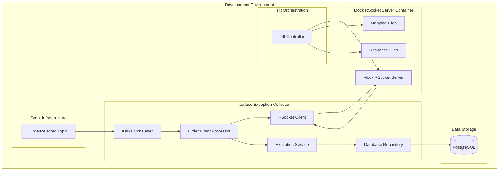
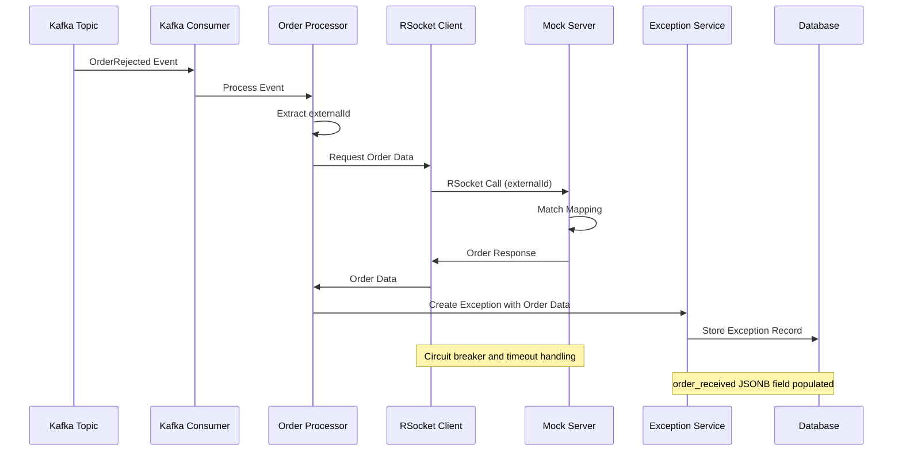

# Mock RSocket Server Integration Design Document

## Overview

The Mock RSocket Server Integration enhances the BioPro Interface Exception Collector service by adding the capability to retrieve order data from a containerized mock RSocket server during OrderRejected event processing. This integration enables comprehensive development and testing workflows without dependencies on external Partner Order Service instances while maintaining production-ready integration patterns.

### Key Design Principles

- **Development-First Approach**: Optimized for local development and testing scenarios
- **Production Pattern Compatibility**: Uses the same RSocket client patterns that will be used with real services
- **Container-Based Isolation**: Mock server runs in isolated container with configurable responses
- **Flexible Configuration**: Support for different environments and testing scenarios
- **Resilience by Design**: Circuit breakers and fallback mechanisms for robust operation

## Architecture

### High-Level Architecture



### Integration Flow



## Components and Interfaces

### 1. RSocket Client Integration

#### MockRSocketOrderServiceClient
A new client that extends the existing service client pattern and integrates with the mock RSocket server.

```java
@Component
@Slf4j
@ConditionalOnProperty(name = "biopro.rsocket.mock-server.enabled", havingValue = "true")
public class MockRSocketOrderServiceClient extends BaseSourceServiceClient {
    
    @Value("${biopro.rsocket.mock-server.host:localhost}")
    private String mockServerHost;
    
    @Value("${biopro.rsocket.mock-server.port:7000}")
    private int mockServerPort;
    
    @Value("${biopro.rsocket.mock-server.timeout:5s}")
    private Duration timeout;
    
    private RSocketRequester rSocketRequester;
    
    public MockRSocketOrderServiceClient(RestTemplate restTemplate) {
        super(restTemplate, "rsocket://localhost:7000", "mock-rsocket-server");
    }
    
    @Override
    public boolean supports(String interfaceType) {
        return InterfaceType.ORDER.name().equals(interfaceType);
    }
    
    @Override
    @CircuitBreaker(name = "mock-rsocket-server", fallbackMethod = "fallbackGetPayload")
    @TimeLimiter(name = "mock-rsocket-server")
    @Retry(name = "mock-rsocket-server")
    public CompletableFuture<PayloadResponse> getOriginalPayload(InterfaceException exception) {
        log.info("Retrieving order data from mock RSocket server for externalId: {}", 
                exception.getExternalId());
        
        return CompletableFuture.supplyAsync(() -> {
            try {
                Object orderData = rSocketRequester
                    .route("orders.{externalId}", exception.getExternalId())
                    .retrieveMono(Object.class)
                    .timeout(timeout)
                    .block();
                
                return PayloadResponse.builder()
                    .transactionId(exception.getTransactionId())
                    .interfaceType(exception.getInterfaceType().name())
                    .payload(orderData)
                    .sourceService("mock-rsocket-server")
                    .retrieved(orderData != null)
                    .build();
                    
            } catch (Exception e) {
                log.error("Failed to retrieve order data from mock server: {}", e.getMessage());
                return PayloadResponse.builder()
                    .transactionId(exception.getTransactionId())
                    .interfaceType(exception.getInterfaceType().name())
                    .sourceService("mock-rsocket-server")
                    .retrieved(false)
                    .errorMessage(e.getMessage())
                    .build();
            }
        });
    }
    
    @Override
    protected String buildPayloadEndpoint(InterfaceException exception) {
        return "/orders/" + exception.getExternalId();
    }
    
    @Override
    protected String buildRetryEndpoint(InterfaceException exception) {
        return "/orders/" + exception.getExternalId() + "/retry";
    }
}
```

#### Configuration Properties
```yaml
biopro:
  rsocket:
    mock-server:
      enabled: true
      host: localhost
      port: 7000
      timeout: 5s
      circuit-breaker:
        failure-rate-threshold: 50
        wait-duration-in-open-state: 30s
        sliding-window-size: 10
```

### 2. Enhanced Order Event Processing

#### Enhanced Order Event Processing
The existing Kafka event processing will be enhanced to include order data retrieval using the existing service client pattern.

```java
// Enhancement to existing OrderRejectedEventProcessor
@Component
@Slf4j
public class OrderRejectedEventProcessor {
    
    private final SourceServiceClientRegistry clientRegistry;
    private final InterfaceExceptionService exceptionService;
    
    @KafkaListener(topics = "OrderRejected")
    public void processOrderRejectedEvent(OrderRejectedEvent event) {
        try {
            // Create initial exception record
            InterfaceException exception = InterfaceException.builder()
                .transactionId(event.getPayload().getTransactionId())
                .interfaceType(InterfaceType.ORDER)
                .exceptionReason(event.getPayload().getRejectedReason())
                .operation(event.getPayload().getOperation())
                .externalId(event.getPayload().getExternalId())
                .customerId(event.getPayload().getCustomerId())
                .locationCode(event.getPayload().getLocationCode())
                .status(ExceptionStatus.NEW)
                .severity(determineSeverity(event.getPayload().getRejectedReason()))
                .category(determineCategory(event.getPayload().getRejectedReason()))
                .orderRetrievalAttempted(false)
                .build();
            
            // Attempt to retrieve order data
            retrieveAndStoreOrderData(exception);
            
            exceptionService.createException(exception);
            
        } catch (Exception e) {
            log.error("Failed to process OrderRejected event: {}", event, e);
            createFallbackException(event, e);
        }
    }
    
    private void retrieveAndStoreOrderData(InterfaceException exception) {
        try {
            exception.setOrderRetrievalAttempted(true);
            
            SourceServiceClient client = clientRegistry.getClient(InterfaceType.ORDER.name());
            if (client != null) {
                PayloadResponse response = client.getOriginalPayload(exception)
                    .get(10, TimeUnit.SECONDS);
                
                if (response.isRetrieved()) {
                    exception.setOrderReceived(response.getPayload());
                    exception.setOrderRetrievedAt(OffsetDateTime.now());
                    exception.setRetryable(true);
                    log.info("Successfully retrieved order data for externalId: {}", 
                            exception.getExternalId());
                } else {
                    exception.setOrderRetrievalError(response.getErrorMessage());
                    exception.setRetryable(false);
                    log.warn("Failed to retrieve order data: {}", response.getErrorMessage());
                }
            }
        } catch (Exception e) {
            exception.setOrderRetrievalError(e.getMessage());
            exception.setRetryable(false);
            log.error("Error retrieving order data for externalId: {}", 
                    exception.getExternalId(), e);
        }
    }
}
```

### 3. Database Schema Enhancement

#### Enhanced InterfaceException Entity
The existing `InterfaceException` entity will be enhanced to include order data storage:

```java
// Add to existing InterfaceException.java
@Column(name = "order_received", columnDefinition = "jsonb")
@JdbcTypeCode(SqlTypes.JSON)
private Object orderReceived;  // Store complete order data as JSON

@Column(name = "order_retrieval_attempted")
@Builder.Default
private Boolean orderRetrievalAttempted = false;

@Column(name = "order_retrieval_error")
private String orderRetrievalError;

@Column(name = "order_retrieved_at")
private OffsetDateTime orderRetrievedAt;
```

#### Database Migration
```sql
-- V16__Add_order_data_fields.sql
ALTER TABLE interface_exceptions 
ADD COLUMN order_received JSONB,
ADD COLUMN order_retrieval_attempted BOOLEAN DEFAULT FALSE,
ADD COLUMN order_retrieval_error TEXT,
ADD COLUMN order_retrieved_at TIMESTAMP WITH TIME ZONE;

-- Index for order data queries
CREATE INDEX idx_interface_exceptions_order_received 
ON interface_exceptions USING gin(order_received);

-- Index for retrieval status
CREATE INDEX idx_interface_exceptions_order_retrieval 
ON interface_exceptions(order_retrieval_attempted, order_retrieved_at);

-- Add comments for documentation
COMMENT ON COLUMN interface_exceptions.order_received IS 'Complete order data retrieved from Partner Order Service or mock server';
COMMENT ON COLUMN interface_exceptions.order_retrieval_attempted IS 'Whether order data retrieval was attempted';
COMMENT ON COLUMN interface_exceptions.order_retrieval_error IS 'Error message if order retrieval failed';
COMMENT ON COLUMN interface_exceptions.order_retrieved_at IS 'Timestamp when order data was successfully retrieved';
```

### 4. Mock Server Container Integration

#### Tilt Configuration Enhancement
```python
# Mock RSocket Server
k8s_yaml('k8s/mock-rsocket-server.yaml')
k8s_resource(
    'mock-rsocket-server',
    port_forwards='7000:7000',
    resource_deps=['kafka']
)

# Watch for mapping file changes
watch_file('./mappings')
watch_file('./mock-responses')

# Restart mock server when mappings change
local_resource(
    'reload-mock-mappings',
    'kubectl rollout restart deployment/mock-rsocket-server -n ' + namespace,
    deps=['mappings', 'mock-responses'],
    auto_init=False,
    trigger_mode=TRIGGER_MODE_AUTO
)
```

#### Kubernetes Deployment Configuration
```yaml
# k8s/mock-rsocket-server.yaml
apiVersion: apps/v1
kind: Deployment
metadata:
  name: mock-rsocket-server
spec:
  replicas: 1
  selector:
    matchLabels:
      app: mock-rsocket-server
  template:
    metadata:
      labels:
        app: mock-rsocket-server
    spec:
      containers:
      - name: mock-rsocket-server
        image: artifactory.sha.ao.arc-one.com/docker/biopro/utils/rsocket_mock:21.0.1
        ports:
        - containerPort: 7000
        volumeMounts:
        - name: mappings
          mountPath: /app/mappings
        - name: responses
          mountPath: /app/__files
        env:
        - name: SERVER_PORT
          value: "7000"
        - name: MAPPINGS_PATH
          value: "/app/mappings"
        - name: RESPONSES_PATH
          value: "/app/__files"
        livenessProbe:
          tcpSocket:
            port: 7000
          initialDelaySeconds: 10
          periodSeconds: 30
        readinessProbe:
          tcpSocket:
            port: 7000
          initialDelaySeconds: 5
          periodSeconds: 10
      volumes:
      - name: mappings
        configMap:
          name: mock-rsocket-mappings
      - name: responses
        configMap:
          name: mock-rsocket-responses
---
apiVersion: v1
kind: Service
metadata:
  name: mock-rsocket-server
spec:
  selector:
    app: mock-rsocket-server
  ports:
  - port: 7000
    targetPort: 7000
```

### 5. Mock Server Configuration Management

#### Mapping Configuration Structure
```
mappings/
├── order-success-mapping.json
├── order-not-found-mapping.json
├── order-validation-error-mapping.json
└── default-fallback-mapping.json

mock-responses/
├── orders/
│   ├── complete-order-with-items.json
│   ├── minimal-order.json
│   └── test-order-scenarios/
│       ├── TEST-ORDER-1.json
│       ├── TEST-ORD-2025-018.json
│       └── BULK-ORDER-123.json
└── errors/
    ├── not-found.json
    ├── validation-error.json
    └── server-error.json
```

#### Example Mapping Files

**order-success-mapping.json**
```json
{
  "request": {
    "routePathPattern": "orders\\.([A-Z0-9-]+)"
  },
  "response": {
    "status": 200,
    "bodyFileName": "orders/complete-order-with-items.json",
    "headers": {
      "Content-Type": "application/json"
    }
  }
}
```

**order-not-found-mapping.json**
```json
{
  "request": {
    "routePathPattern": "orders\\.(NOTFOUND-.*)"
  },
  "response": {
    "status": 404,
    "bodyFileName": "errors/not-found.json"
  }
}
```

#### Example Response Files

**complete-order-with-items.json** (Complete Order Response)
```json
{
  "externalId": "TEST-ORDER-1",
  "customerId": "CUST001",
  "locationCode": "LOC001",
  "orderDate": "2025-01-15T10:30:00Z",
  "status": "PENDING",
  "totalAmount": 1250.00,
  "currency": "USD",
  "orderItems": [
    {
      "itemId": "ITEM001",
      "productCode": "PROD-ABC123",
      "bloodType": "O_POS",
      "productFamily": "RED_BLOOD_CELLS",
      "quantity": 2,
      "unitPrice": 500.00,
      "totalPrice": 1000.00,
      "attributes": {
        "expirationDate": "2025-02-15",
        "donorId": "DONOR123"
      }
    },
    {
      "itemId": "ITEM002",
      "productCode": "PROD-XYZ789",
      "bloodType": "A_NEG",
      "productFamily": "PLATELETS",
      "quantity": 1,
      "unitPrice": 250.00,
      "totalPrice": 250.00,
      "attributes": {
        "expirationDate": "2025-01-20",
        "donorId": "DONOR456"
      }
    }
  ],
  "customerInfo": {
    "name": "Test Customer Hospital",
    "email": "orders@testcustomer.com",
    "phone": "+1-555-0123",
    "contactPerson": "Dr. Jane Smith"
  },
  "shippingAddress": {
    "street": "123 Hospital Drive",
    "city": "Medical City",
    "state": "TX",
    "zipCode": "12345",
    "country": "US",
    "deliveryInstructions": "Deliver to Blood Bank - Building A"
  },
  "metadata": {
    "priority": "URGENT",
    "deliveryDate": "2025-01-16T08:00:00Z",
    "specialHandling": true,
    "temperatureControlled": true
  }
}
```

This complete order structure includes all the data needed for retry operations, including multiple order items with BioPro-specific fields like blood type and product family.

## Data Models

#### Complete Order Data Storage
The mock RSocket server returns **complete order data** including:
- Order metadata (externalId, customerId, locationCode, orderDate, status, totalAmount)
- Customer information (name, email, phone)
- Shipping address details
- **Multiple order items** (each with itemId, productCode, quantity, unitPrice, totalPrice)
- Additional metadata and attributes

This complete order data will be stored as JSON in the `order_received` JSONB field for use in retry operations.

#### Integration with Existing OrderItem Entity
The existing `OrderItem` entity (which stores individual blood type/product family items from OrderRejected events) will continue to work alongside the new complete order data storage:

- **OrderItem entities**: Store structured data extracted from OrderRejected event payload
- **order_received JSONB field**: Store complete order data retrieved from mock RSocket server

This dual approach provides both structured access to order items and complete order context for retry operations.

### Enhanced Event Schema
```java
@Data
@Builder
@NoArgsConstructor
@AllArgsConstructor
public class OrderRejectedEvent {
    private String eventId;
    private String eventType;
    private String eventVersion;
    private LocalDateTime occurredOn;
    private String source;
    private String correlationId;
    private OrderRejectedPayload payload;
}

@Data
@Builder
@NoArgsConstructor
@AllArgsConstructor
public class OrderRejectedPayload {
    private String transactionId;
    private String externalId; // Pattern: ^[A-Z0-9-]+$
    private String operation;
    private String rejectedReason;
    private String customerId;
    private String locationCode;
    // Additional fields for enhanced processing
    private Map<String, Object> additionalData;
}
```

## Error Handling

### RSocket Client Error Handling

#### Circuit Breaker Configuration
```yaml
resilience4j:
  circuitbreaker:
    instances:
      mock-rsocket-server:
        failure-rate-threshold: 50
        wait-duration-in-open-state: 30s
        sliding-window-size: 10
        minimum-number-of-calls: 5
        permitted-number-of-calls-in-half-open-state: 3
  
  timelimiter:
    instances:
      mock-rsocket-server:
        timeout-duration: 5s
  
  retry:
    instances:
      mock-rsocket-server:
        max-attempts: 3
        wait-duration: 1s
        exponential-backoff-multiplier: 2
```

#### Error Scenarios and Handling

1. **Mock Server Unavailable**
   - Circuit breaker opens after threshold failures
   - Fallback creates exception record with null order data
   - Exception marked as non-retryable
   - Detailed error logging for troubleshooting

2. **Timeout Scenarios**
   - 5-second timeout for RSocket calls
   - Automatic retry with exponential backoff
   - Fallback to creating exception without order data

3. **Invalid Response Data**
   - JSON deserialization error handling
   - Schema validation for order data
   - Fallback to partial data storage where possible

4. **Network Connectivity Issues**
   - Connection pooling and reuse
   - Automatic reconnection on connection loss
   - Health check integration for container status

### Exception Processing Resilience

```java
@Component
@Slf4j
public class ResilientOrderProcessor {
    
    @Retryable(value = {Exception.class}, maxAttempts = 3, backoff = @Backoff(delay = 1000))
    public void processOrderRejectedEvent(OrderRejectedEvent event) {
        try {
            processWithOrderData(event);
        } catch (RSocketException e) {
            log.warn("RSocket call failed, creating exception without order data", e);
            processWithoutOrderData(event, e);
        }
    }
    
    @Recover
    public void recover(Exception ex, OrderRejectedEvent event) {
        log.error("All retry attempts failed for event: {}", event.getEventId(), ex);
        createFailsafeException(event, ex);
    }
}
```

## Testing Strategy

### Unit Testing

#### RSocket Client Testing
```java
@ExtendWith(MockitoExtension.class)
class OrderDataRSocketClientTest {
    
    @Mock
    private RSocketRequester rSocketRequester;
    
    @Mock
    private RSocketRequester.RequestSpec requestSpec;
    
    @InjectMocks
    private OrderDataRSocketClient client;
    
    @Test
    void shouldRetrieveOrderDataSuccessfully() {
        // Given
        String externalId = "TEST-ORDER-1";
        OrderData expectedOrder = OrderData.builder()
            .externalId(externalId)
            .customerId("CUST001")
            .build();
        
        when(rSocketRequester.route("orders.{externalId}", externalId))
            .thenReturn(requestSpec);
        when(requestSpec.retrieveMono(OrderData.class))
            .thenReturn(Mono.just(expectedOrder));
        
        // When
        OrderData result = client.getOrderData(externalId).block();
        
        // Then
        assertThat(result).isEqualTo(expectedOrder);
    }
    
    @Test
    void shouldHandleTimeoutGracefully() {
        // Given
        String externalId = "TIMEOUT-ORDER";
        
        when(rSocketRequester.route("orders.{externalId}", externalId))
            .thenReturn(requestSpec);
        when(requestSpec.retrieveMono(OrderData.class))
            .thenReturn(Mono.delay(Duration.ofSeconds(10))
                .then(Mono.just(new OrderData())));
        
        // When & Then
        StepVerifier.create(client.getOrderData(externalId))
            .expectError(TimeoutException.class)
            .verify();
    }
}
```

### Integration Testing

#### Mock Server Integration Test
```java
@SpringBootTest
@Testcontainers
class MockRSocketServerIntegrationTest {
    
    @Container
    static GenericContainer<?> mockServer = new GenericContainer<>("rsocket-mock:test")
        .withExposedPorts(7000)
        .withClasspathResourceMapping("test-mappings", "/app/mappings", BindMode.READ_ONLY)
        .withClasspathResourceMapping("test-responses", "/app/__files", BindMode.READ_ONLY);
    
    @Autowired
    private OrderDataRSocketClient client;
    
    @DynamicPropertySource
    static void configureProperties(DynamicPropertyRegistry registry) {
        registry.add("biopro.rsocket.mock-server.host", mockServer::getHost);
        registry.add("biopro.rsocket.mock-server.port", 
            () -> mockServer.getMappedPort(7000));
    }
    
    @Test
    void shouldRetrieveOrderFromMockServer() {
        // When
        OrderData result = client.getOrderData("TEST-ORDER-1").block();
        
        // Then
        assertThat(result).isNotNull();
        assertThat(result.getExternalId()).isEqualTo("TEST-ORDER-1");
        assertThat(result.getOrderItems()).isNotEmpty();
    }
}
```

### End-to-End Testing

#### Complete Flow Testing
```java
@SpringBootTest
@EmbeddedKafka
@Testcontainers
class OrderRejectedEventE2ETest {
    
    @Autowired
    private KafkaTemplate<String, Object> kafkaTemplate;
    
    @Autowired
    private InterfaceExceptionRepository exceptionRepository;
    
    @Test
    void shouldProcessOrderRejectedEventWithOrderData() {
        // Given
        OrderRejectedEvent event = OrderRejectedEvent.builder()
            .eventId(UUID.randomUUID().toString())
            .eventType("OrderRejected")
            .eventVersion("1.0")
            .payload(OrderRejectedPayload.builder()
                .transactionId(UUID.randomUUID().toString())
                .externalId("TEST-ORDER-1")
                .operation("CREATE_ORDER")
                .rejectedReason("Order already exists")
                .customerId("CUST001")
                .build())
            .build();
        
        // When
        kafkaTemplate.send("OrderRejected", event);
        
        // Then
        await().atMost(Duration.ofSeconds(10))
            .untilAsserted(() -> {
                List<InterfaceException> exceptions = exceptionRepository.findAll();
                assertThat(exceptions).hasSize(1);
                
                InterfaceException exception = exceptions.get(0);
                assertThat(exception.getOrderReceived()).isNotNull();
                assertThat(exception.getOrderReceived().getExternalId()).isEqualTo("TEST-ORDER-1");
                assertThat(exception.isRetryable()).isTrue();
            });
    }
}
```

## Configuration Management

### Environment-Specific Configuration

#### Development Environment
```yaml
# application-dev.yml
biopro:
  rsocket:
    mock-server:
      enabled: true
      host: localhost
      port: 7000
      timeout: 5s
      debug-logging: true

logging:
  level:
    com.arcone.biopro.exception.collector.rsocket: DEBUG
```

#### Testing Environment
```yaml
# application-test.yml
biopro:
  rsocket:
    mock-server:
      enabled: true
      host: mock-rsocket-server
      port: 7000
      timeout: 10s
      circuit-breaker:
        failure-rate-threshold: 30
        wait-duration-in-open-state: 10s
```

#### Production Environment
```yaml
# application-prod.yml
biopro:
  rsocket:
    mock-server:
      enabled: false  # Disabled in production
    partner-order-service:
      enabled: true
      host: partner-order-service
      port: 8090
```

### Feature Flags and Client Registration

```java
@Configuration
public class SourceServiceClientConfiguration {
    
    @Bean
    @ConditionalOnProperty(name = "biopro.rsocket.mock-server.enabled", havingValue = "true")
    @Primary
    public SourceServiceClient mockRSocketOrderServiceClient(RestTemplate restTemplate) {
        return new MockRSocketOrderServiceClient(restTemplate);
    }
    
    @Bean
    @ConditionalOnProperty(name = "biopro.rsocket.partner-order-service.enabled", havingValue = "true")
    public SourceServiceClient productionOrderServiceClient(RestTemplate restTemplate,
            @Value("${app.source-services.order.base-url}") String baseUrl) {
        return new OrderServiceClient(restTemplate, baseUrl);
    }
}
```

## Monitoring and Observability

### Metrics Collection

#### Custom Metrics
```java
@Component
public class RSocketMetrics {
    
    private final Counter rSocketCallsTotal;
    private final Timer rSocketCallDuration;
    private final Counter rSocketErrors;
    
    public RSocketMetrics(MeterRegistry meterRegistry) {
        this.rSocketCallsTotal = Counter.builder("rsocket.calls.total")
            .description("Total RSocket calls made")
            .tag("service", "mock-server")
            .register(meterRegistry);
            
        this.rSocketCallDuration = Timer.builder("rsocket.call.duration")
            .description("RSocket call duration")
            .register(meterRegistry);
            
        this.rSocketErrors = Counter.builder("rsocket.errors.total")
            .description("RSocket call errors")
            .register(meterRegistry);
    }
}
```

#### Health Check Integration
```java
@Component
public class MockRSocketServerHealthIndicator implements HealthIndicator {
    
    private final OrderDataRSocketClient client;
    
    @Override
    public Health health() {
        try {
            // Attempt a simple health check call
            client.getOrderData("HEALTH-CHECK").block(Duration.ofSeconds(2));
            return Health.up()
                .withDetail("mock-server", "Available")
                .build();
        } catch (Exception e) {
            return Health.down()
                .withDetail("mock-server", "Unavailable")
                .withDetail("error", e.getMessage())
                .build();
        }
    }
}
```

### Logging Strategy

#### Structured Logging
```java
@Slf4j
@Component
public class RSocketLoggingInterceptor {
    
    public void logRSocketCall(String externalId, String operation, Duration duration, boolean success) {
        MDC.put("rsocket.external_id", externalId);
        MDC.put("rsocket.operation", operation);
        MDC.put("rsocket.duration_ms", String.valueOf(duration.toMillis()));
        MDC.put("rsocket.success", String.valueOf(success));
        
        if (success) {
            log.info("RSocket call completed successfully");
        } else {
            log.warn("RSocket call failed");
        }
        
        MDC.clear();
    }
}
```

## Security Considerations

### Container Security
- **Base Image Security**: Use minimal, security-scanned base images
- **Network Isolation**: Container-to-container communication only
- **Resource Limits**: CPU and memory constraints to prevent resource exhaustion
- **Non-Root Execution**: Run container processes as non-root user

### Data Security
- **Mock Data Sanitization**: Ensure no real customer data in mock responses
- **Configuration Security**: Secure storage of mapping files and configurations
- **Access Control**: Restrict access to mock server configuration endpoints

### Development Security
- **Local Environment Isolation**: Mock server only accessible in development
- **Configuration Validation**: Prevent accidental production deployment with mock enabled
- **Audit Logging**: Track all mock server interactions for debugging

This design document provides a comprehensive framework for implementing the Mock RSocket Server Integration while maintaining production-ready patterns and ensuring robust development and testing capabilities.