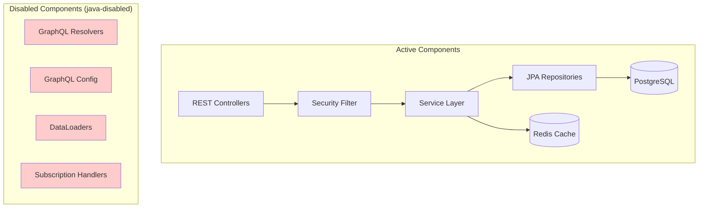
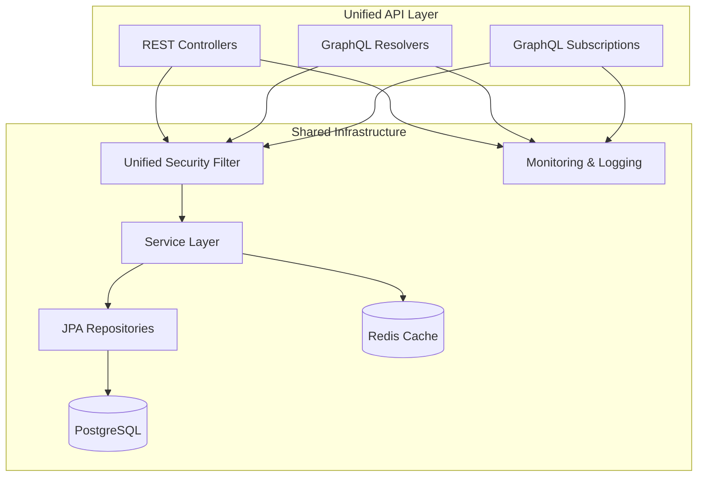

# Design Document

## Overview

This design document focuses specifically on the **integration architecture** for activating the existing GraphQL implementation alongside the current REST API. The comprehensive GraphQL design (schema, resolvers, DataLoaders, subscriptions, etc.) is already documented in `.kiro/specs/interface-exception-graphql-api/design.md`. This document addresses the specific challenges of making both APIs coexist and share infrastructure.

**Key Integration Challenge**: The GraphQL implementation exists but is disabled (in `java-disabled` directory). The main challenge is activating it without breaking the existing REST API and ensuring both APIs share the same security, business logic, and infrastructure.

## Integration Architecture

### Current State vs Target State

**Current State:**


**Target State:**


### Integration Points

#### 1. Security Integration Challenge

**Problem**: Two security configurations exist:
- Active: `SecurityConfig.java` (handles REST endpoints)
- Disabled: `GraphQLSecurityConfig.java` (designed for GraphQL endpoints)

**Solution**: Unified Security Configuration
```java
@Configuration
@EnableWebSecurity
@EnableMethodSecurity(prePostEnabled = true)
public class UnifiedSecurityConfig {
    
    @Bean
    public SecurityFilterChain securityFilterChain(HttpSecurity http) throws Exception {
        return http
                .authorizeHttpRequests(authz -> authz
                        // Existing REST endpoints
                        .requestMatchers("/api/v1/**").authenticated()
                        
                        // New GraphQL endpoints
                        .requestMatchers("/graphql").authenticated()
                        .requestMatchers("/subscriptions").authenticated()
                        .requestMatchers("/graphiql/**").permitAll() // Dev only
                        
                        // Existing public endpoints
                        .requestMatchers("/actuator/health/**").permitAll()
                        .requestMatchers("/swagger-ui/**").permitAll()
                        
                        .anyRequest().authenticated())
                // Existing JWT filter continues to work for both APIs
                .addFilterBefore(jwtAuthenticationFilter, UsernamePasswordAuthenticationFilter.class)
                .build();
    }
}
```

#### 2. Service Layer Integration

**Problem**: GraphQL resolvers need to use the same business logic as REST controllers.

**Solution**: Shared Service Layer Pattern
```java
// Existing service (no changes needed)
@Service
public class ExceptionQueryService {
    public List<InterfaceException> findExceptionsWithFilters(...) {
        // Existing implementation
    }
}

// REST Controller (existing, no changes)
@RestController
public class ExceptionController {
    @Autowired
    private ExceptionQueryService exceptionQueryService;
    
    @GetMapping("/api/v1/exceptions")
    public List<ExceptionListResponse> listExceptions(...) {
        return exceptionQueryService.findExceptionsWithFilters(...);
    }
}

// GraphQL Resolver (activated from java-disabled)
@Controller
public class ExceptionQueryResolver {
    @Autowired
    private ExceptionQueryService exceptionQueryService; // Same service!
    
    @QueryMapping
    public ExceptionConnection exceptions(...) {
        return exceptionQueryService.findExceptionsWithFilters(...);
    }
}
```

#### 3. Configuration Integration

**Problem**: Multiple configuration files need to be activated and integrated.

**Solution**: Conditional Configuration Activation
```java
// Main GraphQL configuration (moved from java-disabled)
@Configuration
@ConditionalOnProperty(name = "graphql.enabled", havingValue = "true", matchIfMissing = true)
public class GraphQLConfig {
    // Existing configuration from java-disabled
}

// Application.yml integration
spring:
  graphql:
    graphiql:
      enabled: ${GRAPHQL_GRAPHIQL_ENABLED:false}
    schema:
      locations: classpath:graphql/
  
# Feature flag for gradual rollout
graphql:
  enabled: ${GRAPHQL_ENABLED:true}
```

#### 4. Monitoring Integration

**Problem**: Need unified monitoring for both APIs.

**Solution**: Extend Existing Monitoring
```java
// Existing monitoring (no changes)
@Component
public class RestApiMetrics {
    private final Counter restRequestCounter = Counter.builder("api.requests")
        .tag("type", "rest")
        .register(Metrics.globalRegistry);
}

// New GraphQL monitoring (integrated with existing)
@Component
public class GraphQLMetrics {
    private final Counter graphqlRequestCounter = Counter.builder("api.requests")
        .tag("type", "graphql") // Same metric, different tag
        .register(Metrics.globalRegistry);
        
    @EventListener
    public void onGraphQLRequest(GraphQLRequestEvent event) {
        graphqlRequestCounter.increment();
    }
}
```

## File Movement and Activation Plan

### Directory Structure Changes

**Before (Current State):**
```
src/main/java-disabled/
├── GraphQLConfig.java
├── graphql/
│   ├── resolver/
│   │   ├── ExceptionQueryResolver.java
│   │   ├── ExceptionMutationResolver.java
│   │   └── ExceptionSubscriptionResolver.java
│   ├── dataloader/
│   │   ├── ExceptionDataLoader.java
│   │   └── RetryHistoryDataLoader.java
│   └── service/
│       └── ExceptionEventPublisher.java
```

**After (Target State):**
```
src/main/java/com/arcone/biopro/exception/collector/
├── infrastructure/config/
│   └── GraphQLConfig.java (moved and activated)
└── api/graphql/
    ├── resolver/
    │   ├── ExceptionQueryResolver.java (moved and activated)
    │   ├── ExceptionMutationResolver.java (moved and activated)
    │   └── ExceptionSubscriptionResolver.java (moved and activated)
    ├── dataloader/
    │   ├── ExceptionDataLoader.java (moved and activated)
    │   └── RetryHistoryDataLoader.java (moved and activated)
    └── service/
        └── ExceptionEventPublisher.java (moved and activated)
```

### Package Declaration Updates

**Before:**
```java
package com.arcone.biopro.exception.collector.api.graphql.resolver;
// This package doesn't exist in active code
```

**After:**
```java
package com.arcone.biopro.exception.collector.api.graphql.resolver;
// Now this package exists and is active
```

## Integration Testing Strategy

### Dual API Consistency Testing

**Test Approach**: Verify both APIs return equivalent data
```java
@SpringBootTest
class DualApiConsistencyTest {
    
    @Test
    void restAndGraphQLReturnEquivalentExceptionData() {
        // Given: Same test data
        String jwt = generateTestJwt();
        
        // When: Call both APIs
        List<ExceptionListResponse> restResponse = callRestAPI(jwt);
        List<Exception> graphqlResponse = callGraphQLAPI(jwt);
        
        // Then: Data should be equivalent
        assertThat(restResponse).hasSize(graphqlResponse.size());
        // Additional equivalence assertions
    }
    
    @Test
    void restAndGraphQLSecurityBehaviorIsConsistent() {
        // Test that both APIs handle authentication/authorization the same way
    }
}
```

### Performance Comparison Testing

**Test Approach**: Ensure GraphQL doesn't degrade REST performance
```java
@Test
void graphqlActivationDoesNotDegradeRestPerformance() {
    // Measure REST API performance before and after GraphQL activation
    // Ensure no significant performance regression
}
```

## Configuration Management

### Environment-Specific Configuration

**Development:**
```yaml
graphql:
  enabled: true
  graphiql:
    enabled: true
logging:
  level:
    org.springframework.graphql: DEBUG
```

**Production:**
```yaml
graphql:
  enabled: true
  graphiql:
    enabled: false
  query:
    max-complexity: 1000
    max-depth: 10
```

### Feature Flag Implementation

**Gradual Rollout Strategy:**
```java
@Configuration
public class GraphQLFeatureConfig {
    
    @Bean
    @ConditionalOnProperty(name = "graphql.enabled", havingValue = "true")
    public GraphQLConfigurer graphqlConfigurer() {
        return new GraphQLConfigurer();
    }
    
    // If GraphQL is disabled, only REST endpoints are available
    // If GraphQL is enabled, both REST and GraphQL endpoints are available
}
```

## Risk Mitigation

### Rollback Strategy

**If GraphQL Activation Fails:**
1. **Immediate**: Set `graphql.enabled=false` in configuration
2. **Code Rollback**: Move GraphQL files back to `java-disabled`
3. **Verification**: Ensure REST API continues to function normally

### Monitoring and Alerting

**Key Metrics to Monitor:**
- REST API response times (ensure no degradation)
- GraphQL query performance
- Error rates for both APIs
- Memory and CPU usage changes
- Database connection pool utilization

**Alert Conditions:**
- REST API response time increases > 20%
- GraphQL error rate > 5%
- Database connection pool exhaustion
- Memory usage increases > 30%

## Deployment Considerations

### Blue-Green Deployment Support

**Strategy**: Deploy with GraphQL disabled initially, then enable via feature flag
```yaml
# Initial deployment
graphql:
  enabled: false

# After verification, enable GraphQL
graphql:
  enabled: true
```

### Health Check Integration

**Unified Health Checks:**
```java
@Component
public class DualApiHealthIndicator implements HealthIndicator {
    
    @Override
    public Health health() {
        Health.Builder builder = Health.up();
        
        // Check REST API health
        builder.withDetail("rest-api", checkRestApiHealth());
        
        // Check GraphQL health (if enabled)
        if (graphqlEnabled) {
            builder.withDetail("graphql-api", checkGraphQLHealth());
        }
        
        return builder.build();
    }
}
```

This integration design ensures that the existing GraphQL implementation can be activated alongside the REST API with minimal risk and maximum reuse of existing infrastructure.