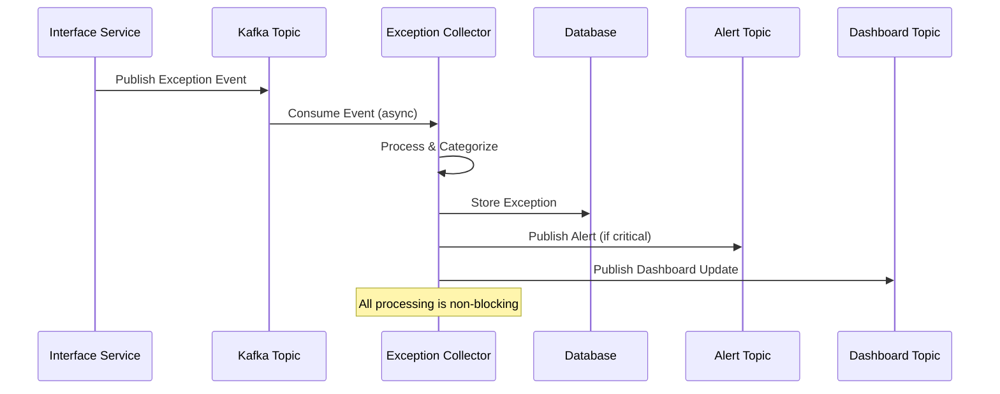

# ADR-001: Event-Driven Exception Management Architecture

## Status
**Accepted** - 2025-08-21

## Context

The BioPro platform consists of multiple interface services (Order, Collection, Distribution, Recruitment) that process critical healthcare operations. Each service can encounter various types of exceptions during processing, including business rule violations, validation errors, external service failures, and system errors.

### Current Challenges

1. **Distributed Exception Handling**: Each interface service handles exceptions independently, leading to:
   - Inconsistent exception handling patterns
   - Lack of centralized visibility into system health
   - Difficulty in correlating related exceptions across services
   - Manual intervention required for exception resolution

2. **Operational Visibility**: Operations teams lack:
   - Real-time visibility into exception patterns
   - Centralized dashboard for monitoring system health
   - Automated alerting for critical exceptions
   - Historical analysis capabilities for trend identification

3. **Recovery Mechanisms**: Current system limitations:
   - No standardized retry mechanisms across services
   - Manual intervention required for most exception recovery
   - Lack of audit trail for exception resolution activities
   - No correlation between exceptions and business impact

4. **Scalability Concerns**: As the platform grows:
   - Exception volume will increase significantly
   - Need for horizontal scaling of exception processing
   - Requirements for high availability and fault tolerance
   - Integration with additional interface services

### Business Requirements

- **Centralized Exception Management**: Single point of control for all interface exceptions
- **Real-time Monitoring**: Live dashboards for operations teams
- **Automated Recovery**: Intelligent retry mechanisms with minimal manual intervention
- **Comprehensive Audit Trail**: Complete lifecycle tracking of exceptions
- **Scalable Architecture**: Support for growing exception volumes and new services
- **High Availability**: 99.9% uptime requirement for exception processing

## Decision

We will implement an **Event-Driven Exception Management Architecture** using Apache Kafka as the central event streaming platform for the Interface Exception Collector Service.

### Core Architectural Components

#### 1. Event-Driven Communication Pattern

**Implementation**:
- All interface services publish exception events to dedicated Kafka topics
- Exception Collector Service consumes events asynchronously
- Downstream systems receive notifications through published events
- Event sourcing pattern for complete audit trail

**Event Topics**:
```yaml
Inbound Topics:
  - OrderRejected: Order processing failures
  - OrderCancelled: Order cancellation events
  - CollectionRejected: Collection workflow failures
  - DistributionFailed: Distribution process errors
  - ValidationError: Schema and business rule violations

Outbound Topics:
  - ExceptionCaptured: New exception notifications
  - ExceptionResolved: Resolution notifications
  - ExceptionRetryCompleted: Retry operation results
  - CriticalExceptionAlert: High-priority alerts
```

#### 2. Asynchronous Processing Architecture

**Event Processing Flow**:


#### 3. Consumer Group Strategy

**Parallel Processing Design**:
```yaml
Consumer Groups:
  exception-collector-main:
    topics: [OrderRejected, CollectionRejected, DistributionFailed, ValidationError]
    partitions: 3 per topic
    instances: 3
    processing: parallel
    max_poll_records: 100
    
  exception-collector-alerts:
    topics: [CriticalExceptionAlert]
    partitions: 1
    instances: 2
    processing: sequential (for alert ordering)
    
  exception-collector-retry:
    topics: [ExceptionRetryRequested]
    partitions: 2
    instances: 2
    processing: parallel
```

#### 4. Event Schema Design

**Standardized Event Structure**:
```json
{
  "eventId": "uuid",
  "eventType": "OrderRejected",
  "eventVersion": "1.0",
  "occurredOn": "2025-08-21T10:30:00Z",
  "source": "order-service",
  "correlationId": "uuid",
  "causationId": "uuid",
  "payload": {
    "transactionId": "uuid",
    "externalId": "ORDER-ABC123",
    "operation": "CREATE_ORDER",
    "rejectedReason": "Order already exists",
    "customerId": "CUST001",
    "locationCode": "LOC001",
    "metadata": {
      "retryable": true,
      "severity": "MEDIUM",
      "category": "BUSINESS_RULE"
    }
  }
}
```

#### 5. Fault Tolerance and Resilience

**Error Handling Strategy**:
- **Dead Letter Queues**: Failed messages routed to DLQ for manual review
- **Retry Mechanisms**: Exponential backoff for transient failures
- **Circuit Breakers**: Protection against cascading failures
- **Idempotent Processing**: Safe message reprocessing using transaction IDs

**Resilience Patterns**:
```yaml
Retry Configuration:
  max_attempts: 3
  backoff_strategy: exponential
  initial_delay: 1s
  max_delay: 30s
  
Circuit Breaker:
  failure_threshold: 5
  timeout: 30s
  half_open_max_calls: 3
  
Dead Letter Queue:
  enabled: true
  max_delivery_attempts: 3
  retention: 7 days
```

## Rationale

### Why Event-Driven Architecture?

#### 1. **Loose Coupling**
- **Problem**: Direct service-to-service calls create tight coupling
- **Solution**: Event-driven communication eliminates direct dependencies
- **Benefit**: Services can evolve independently without breaking integrations

#### 2. **Scalability**
- **Problem**: Synchronous processing creates bottlenecks
- **Solution**: Asynchronous event processing enables independent scaling
- **Benefit**: Each component can scale based on its specific load patterns

#### 3. **Resilience**
- **Problem**: Service failures cascade through synchronous calls
- **Solution**: Event persistence ensures no data loss during failures
- **Benefit**: System continues operating even when individual components fail

#### 4. **Auditability**
- **Problem**: Lack of complete audit trail for exception lifecycle
- **Solution**: Event sourcing provides immutable event history
- **Benefit**: Complete traceability and ability to replay events for debugging

#### 5. **Real-time Capabilities**
- **Problem**: Batch processing delays critical exception notifications
- **Solution**: Stream processing enables real-time event handling
- **Benefit**: Immediate alerts and dashboard updates for critical exceptions

### Why Apache Kafka?

#### 1. **High Throughput and Low Latency**
- Handles millions of events per second
- Sub-millisecond latency for event delivery
- Horizontal scaling through partitioning

#### 2. **Durability and Reliability**
- Persistent event storage with configurable retention
- Replication across multiple brokers
- Guaranteed message delivery with acknowledgments

#### 3. **Ecosystem and Tooling**
- Rich ecosystem of connectors and tools
- Excellent monitoring and management capabilities
- Strong community support and documentation

#### 4. **Stream Processing Capabilities**
- Native support for stream processing patterns
- Integration with Kafka Streams for complex event processing
- Support for exactly-once semantics

## Consequences

### Positive Consequences

#### 1. **Improved System Resilience**
- **Fault Isolation**: Failures in one service don't cascade to others
- **Graceful Degradation**: System continues operating with reduced functionality
- **Automatic Recovery**: Built-in retry mechanisms and circuit breakers
- **Data Durability**: Event persistence ensures no data loss

#### 2. **Enhanced Scalability**
- **Independent Scaling**: Each component scales based on its load
- **Horizontal Scaling**: Add more consumer instances to handle increased load
- **Partition-based Parallelism**: Process events in parallel across partitions
- **Load Distribution**: Even distribution of processing load

#### 3. **Better Operational Visibility**
- **Real-time Monitoring**: Live dashboards with current system state
- **Historical Analysis**: Complete event history for trend analysis
- **Correlation Tracking**: End-to-end tracing through correlation IDs
- **Performance Metrics**: Detailed metrics for all system components

#### 4. **Simplified Integration**
- **Standardized Interface**: Consistent event schemas across all services
- **Loose Coupling**: Services integrate through events, not direct calls
- **Easy Extension**: New services can easily integrate by consuming events
- **Version Management**: Event versioning supports backward compatibility

### Negative Consequences

#### 1. **Increased Complexity**
- **Distributed System Challenges**: Network partitions, clock skew, consensus
- **Event Ordering**: Ensuring correct event ordering across partitions
- **Debugging Complexity**: Tracing issues across multiple asynchronous components
- **Operational Overhead**: Additional infrastructure to monitor and maintain

**Mitigation Strategies**:
- Comprehensive monitoring and alerting
- Distributed tracing with correlation IDs
- Automated testing of event flows
- Clear documentation and runbooks

#### 2. **Eventual Consistency**
- **Data Consistency**: System state may be temporarily inconsistent
- **Ordering Guarantees**: Events may be processed out of order
- **Duplicate Processing**: Potential for duplicate event processing
- **State Reconciliation**: Need for mechanisms to handle inconsistencies

**Mitigation Strategies**:
- Idempotent event processing using transaction IDs
- Careful partition key selection for ordering requirements
- Monitoring and alerting for consistency violations
- Compensation patterns for handling inconsistencies

#### 3. **Operational Complexity**
- **Infrastructure Management**: Kafka cluster management and monitoring
- **Schema Evolution**: Managing event schema changes over time
- **Consumer Lag Monitoring**: Ensuring consumers keep up with event production
- **Capacity Planning**: Proper sizing of Kafka clusters and consumer groups

**Mitigation Strategies**:
- Managed Kafka services where appropriate
- Automated monitoring and alerting for consumer lag
- Schema registry for managing event schema evolution
- Capacity planning based on historical data and growth projections

#### 4. **Latency Considerations**
- **Processing Latency**: Asynchronous processing introduces latency
- **Network Latency**: Additional network hops for event delivery
- **Batch Processing**: Batching for efficiency may increase latency
- **Consumer Processing Time**: Time required for event processing

**Mitigation Strategies**:
- Optimize consumer processing logic
- Tune Kafka configuration for low latency
- Monitor and alert on processing latencies
- Use appropriate batch sizes for efficiency vs. latency trade-offs

## Implementation Plan

### Phase 1: Foundation (Weeks 1-2)
- Set up Kafka infrastructure and topics
- Implement basic event schemas and serialization
- Create core event consumer framework
- Establish monitoring and alerting

### Phase 2: Core Processing (Weeks 3-4)
- Implement exception event consumers
- Build exception processing and storage logic
- Create event publishers for downstream notifications
- Implement dead letter queue handling

### Phase 3: Integration (Weeks 5-6)
- Integrate with existing interface services
- Implement retry mechanisms and circuit breakers
- Add comprehensive error handling
- Performance testing and optimization

### Phase 4: Operations (Weeks 7-8)
- Implement monitoring dashboards
- Set up alerting and escalation procedures
- Create operational runbooks
- Conduct failure scenario testing

## Monitoring and Success Metrics

### Technical Metrics
- **Event Processing Latency**: < 100ms for 95th percentile
- **Consumer Lag**: < 1000 messages during normal operations
- **Error Rate**: < 0.1% of events result in processing errors
- **Availability**: 99.9% uptime for event processing

### Business Metrics
- **Exception Resolution Time**: 50% reduction in average resolution time
- **Manual Intervention**: 80% reduction in manual exception handling
- **System Visibility**: 100% of exceptions visible in centralized dashboard
- **Alert Response Time**: < 5 minutes for critical exceptions

### Operational Metrics
- **Deployment Frequency**: Weekly deployments without service disruption
- **Mean Time to Recovery**: < 15 minutes for system failures
- **Change Failure Rate**: < 5% of deployments cause issues
- **Lead Time**: < 2 weeks from exception pattern identification to resolution

## Alternatives Considered

### 1. Synchronous REST API Integration

**Approach**: Direct REST API calls between services for exception reporting

**Pros**:
- Simpler to implement initially
- Immediate consistency
- Familiar technology stack

**Cons**:
- Tight coupling between services
- Single point of failure
- Difficult to scale
- No built-in retry mechanisms
- Limited audit trail

**Decision**: Rejected due to scalability and resilience concerns

### 2. Database-Based Integration

**Approach**: Shared database for exception data with polling mechanisms

**Pros**:
- Strong consistency guarantees
- Familiar technology
- Simple transaction management

**Cons**:
- Database becomes bottleneck
- Tight coupling through shared schema
- Polling introduces latency
- Difficult to scale horizontally
- Limited real-time capabilities

**Decision**: Rejected due to coupling and scalability limitations

### 3. Message Queue (RabbitMQ/ActiveMQ)

**Approach**: Traditional message queue for exception event handling

**Pros**:
- Mature technology
- Good tooling and monitoring
- Reliable message delivery

**Cons**:
- Limited scalability compared to Kafka
- No built-in stream processing
- Less suitable for high-throughput scenarios
- Limited retention capabilities

**Decision**: Rejected in favor of Kafka's superior scalability and stream processing capabilities

### 4. Cloud-Native Messaging (AWS SQS/SNS, Azure Service Bus)

**Approach**: Cloud provider managed messaging services

**Pros**:
- Fully managed service
- Built-in scaling and reliability
- Integration with cloud ecosystem

**Cons**:
- Vendor lock-in
- Limited customization options
- Potentially higher costs at scale
- Less control over infrastructure

**Decision**: Rejected to maintain cloud provider independence and cost control

## References

### Technical Documentation
- [Apache Kafka Documentation](https://kafka.apache.org/documentation/)
- [Event-Driven Architecture Patterns](https://microservices.io/patterns/data/event-driven-architecture.html)
- [Spring Kafka Reference](https://docs.spring.io/spring-kafka/docs/current/reference/html/)

### Architecture Patterns
- [Microservices Patterns by Chris Richardson](https://microservices.io/patterns/)
- [Building Event-Driven Microservices by Adam Bellemare](https://www.oreilly.com/library/view/building-event-driven-microservices/9781492057888/)
- [Designing Data-Intensive Applications by Martin Kleppmann](https://dataintensive.net/)

### BioPro Platform Documentation
- Interface Exception Collector Service Requirements (`.kiro/specs/interface-exception-collector/requirements.md`)
- REST/GraphQL Dual API Support Design (`.kiro/specs/rest-graphql-dual-api-support/design.md`)
- Partner Order Service Integration (`.kiro/specs/partner-order-service/design.md`)

---

**Document Information**
- **Author**: Architecture Team
- **Date**: 2025-08-21
- **Version**: 1.0
- **Status**: Accepted
- **Reviewers**: Engineering Team, Operations Team, Product Team
- **Next Review**: 2025-11-21 (3 months)