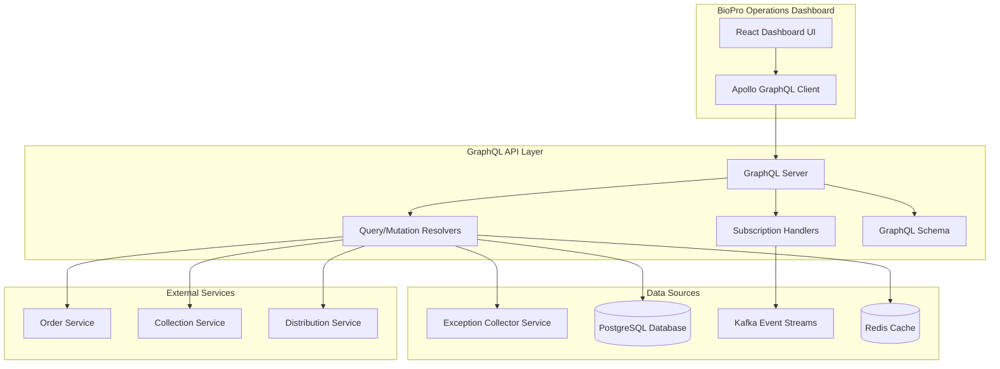

# Interface Exception GraphQL API - Technical Specification

## Executive Summary

The Interface Exception GraphQL API provides a unified, type-safe interface for the BioPro Operations Dashboard to query and manipulate interface exception data. This API layer sits between the dashboard UI and the Interface Exception Collector Service, offering real-time data access, comprehensive filtering capabilities, and mutation operations for exception management.

**Service Name:** Interface Exception GraphQL API  
**Version:** 1.0  
**Target Release:** Q4 2025  
**Dependencies:** Interface Exception Collector Service, PostgreSQL, Kafka  

## Business Problem

The BioPro Operations Dashboard requires a flexible, efficient API that can:

1. **Aggregate Statistics** - Provide real-time metrics for dashboard cards (active exceptions, retry counts, success rates)
2. **Complex Filtering** - Support multiple simultaneous filters (interface type, status, date range, severity)
3. **Real-time Updates** - Stream live exception updates to keep dashboard current
4. **Detailed Views** - Fetch complete exception context including original payloads and retry history
5. **Operational Actions** - Enable retry operations and exception acknowledgment workflows
6. **Performance** - Efficiently handle large datasets with pagination and caching

Traditional REST APIs would require multiple round trips and complex client-side data management to support these dashboard requirements.

## Solution Overview

The GraphQL API solves these challenges by providing:

- **Single Endpoint**: One `/graphql` endpoint for all dashboard operations
- **Type Safety**: Strongly typed schema preventing runtime errors  
- **Efficient Queries**: Request exactly the data needed, reducing payload size
- **Real-time Subscriptions**: Live updates via WebSocket connections
- **Batch Operations**: Multiple mutations in single request for bulk actions
- **Introspection**: Self-documenting API for development teams

## Architecture

### High-Level Architecture



### GraphQL Schema Architecture

The GraphQL schema is organized into logical domains:

1. **Query Root** - Entry point for all read operations
2. **Mutation Root** - Entry point for all write operations  
3. **Subscription Root** - Entry point for real-time updates
4. **Domain Types** - Exception, OriginalPayload, RetryHistory, etc.
5. **Input Types** - Filters, pagination, sorting parameters
6. **Scalar Types** - Custom scalars for dates, JSON, etc.

## Components and Interfaces

### 1. Query Resolvers

**Purpose**: Handle all read operations for the dashboard

#### 1.1 Exception List Resolver
```typescript
exceptions(
  filters: ExceptionFilters,
  pagination: PaginationInput,
  sorting: SortingInput
): ExceptionConnection
```

**Data Sources:**
- Primary: `interface_exceptions` table via JPA repository
- Cache: Redis for frequently accessed filter combinations
- Real-time: Kafka consumer for live updates

**Implementation Notes:**
- Use cursor-based pagination for performance
- Apply database-level filtering before GraphQL processing
- Cache aggregated counts for dashboard cards
- Index on `(interface_type, status, timestamp)` for optimal performance

#### 1.2 Exception Detail Resolver
```typescript
exception(transactionId: String!): Exception
```

**Data Sources:**
- Primary: `interface_exceptions` table join with `original_payloads`
- External: Order/Collection/Distribution services for payload retrieval
- Cache: Redis for recently accessed exception details

**Implementation Notes:**
- Lazy load original payload only when requested
- Use DataLoader pattern to batch external service calls
- Implement circuit breaker for external service failures
- Cache payload data for 1 hour to reduce external calls

#### 1.3 Summary Statistics Resolver
```typescript
exceptionSummary(
  timeRange: TimeRange!,
  groupBy: SummaryGroupBy,
  filters: ExceptionFilters
): ExceptionSummary
```

**Data Sources:**
- Primary: Materialized view `exception_summary_mv` (refreshed every 5 minutes)
- Real-time: Redis counters for current metrics
- Historical: Time-series data in `exception_metrics` table

**Implementation Notes:**
- Pre-aggregate common time ranges (24h, 7d, 30d) in materialized views
- Use Redis INCR/DECR for real-time counter updates
- Implement time-window calculations for trending data
- Background job refreshes materialized views every 5 minutes

### 2. Mutation Resolvers

**Purpose**: Handle all write operations and actions

#### 2.1 Retry Exception Resolver
```typescript
retryException(
  transactionId: String!,
  reason: String,
  priority: RetryPriority
): RetryExceptionResult
```

**Implementation Flow:**
1. Validate exception exists and is retryable
2. Fetch original payload from source service via RSocket
3. Increment retry count and update status to "RETRYING"
4. Submit payload to appropriate internal endpoint (async)
5. Create audit log entry
6. Publish retry event to Kafka
7. Return immediate response with attempt details

**Error Handling:**
- Return structured errors for validation failures
- Implement idempotency to prevent duplicate retries
- Circuit breaker for external service calls
- Rollback database changes on failure

#### 2.2 Acknowledge Exception Resolver
```typescript
acknowledgeException(
  transactionId: String!,
  reason: String,
  notes: String
): AcknowledgeExceptionResult
```

**Implementation Flow:**
1. Validate exception exists and user permissions
2. Update status to "ACKNOWLEDGED"
3. Record acknowledging user and timestamp
4. Create audit log entry
5. Publish acknowledgment event to Kafka
6. Return updated exception details

### 3. Subscription Resolvers

**Purpose**: Provide real-time updates to dashboard

#### 3.1 Exception Updates Subscription
```typescript
exceptionUpdated(filters: ExceptionFilters): ExceptionUpdateEvent
```

**Implementation:**
- Kafka consumer listening to `ExceptionCaptured`, `ExceptionResolved`, `RetryCompleted` topics
- Filter events based on subscription parameters
- Transform Kafka events to GraphQL subscription format
- Use WebSocket connection with heartbeat for reliability

**Event Types:**
- `EXCEPTION_CREATED` - New exception captured
- `EXCEPTION_UPDATED` - Status or details changed
- `RETRY_COMPLETED` - Retry operation finished (success/failure)
- `EXCEPTION_ACKNOWLEDGED` - Exception acknowledged by user

## Domain Model

### Core GraphQL Types

```graphql
type Exception {
  id: ID!
  transactionId: String!
  externalId: String
  interfaceType: InterfaceType!
  exceptionReason: String!
  operation: String!
  status: ExceptionStatus!
  severity: ExceptionSeverity!
  category: ExceptionCategory!
  customerId: String
  locationCode: String
  timestamp: DateTime!
  processedAt: DateTime!
  retryable: Boolean!
  retryCount: Int!
  maxRetries: Int!
  lastRetryAt: DateTime
  acknowledgedBy: String
  acknowledgedAt: DateTime
  acknowledgedReason: String
  resolvedBy: String
  resolvedAt: DateTime
  resolutionMethod: ResolutionMethod
  
  # Nested objects (lazy loaded)
  originalPayload: OriginalPayload
  retryHistory: [RetryAttempt!]!
  correlationChain: [CorrelationEvent!]!
  statusHistory: [StatusChange!]!
}

type OriginalPayload {
  content: JSON!
  contentType: String!
  retrievedAt: DateTime!
  sourceService: String!
}

type RetryAttempt {
  attemptNumber: Int!
  status: RetryStatus!
  initiatedBy: String!
  initiatedAt: DateTime!
  completedAt: DateTime
  resultSuccess: Boolean
  resultMessage: String
  resultResponseCode: Int
  resultErrorDetails: JSON
}

type ExceptionSummary {
  totalExceptions: Int!
  byInterfaceType: [InterfaceTypeSummary!]!
  bySeverity: [SeveritySummary!]!
  byStatus: [StatusSummary!]!
  trends: [TrendDataPoint!]!
  keyMetrics: KeyMetrics!
}

# Input Types for Filtering
input ExceptionFilters {
  interfaceTypes: [InterfaceType!]
  statuses: [ExceptionStatus!]
  severities: [ExceptionSeverity!]
  dateRange: DateRangeInput
  customerIds: [String!]
  locationCodes: [String!]
  searchTerm: String
  excludeResolved: Boolean
  retryable: Boolean
}

input DateRangeInput {
  start: DateTime!
  end: DateTime!
}

# Enums
enum InterfaceType {
  ORDER
  COLLECTION
  DISTRIBUTION
  CUSTOMER
  DONOR_CONTACT
  RBC_ANTIGEN
  TEST_RESULTS
}

enum ExceptionStatus {
  NEW
  ACKNOWLEDGED
  RETRYING
  RESOLVED
  FAILED
}

enum ExceptionSeverity {
  LOW
  MEDIUM
  HIGH
  CRITICAL
}
```

## API Endpoints and Operations

### Query Operations

#### Dashboard Cards Data
```graphql
query GetDashboardCards($filters: ExceptionFilters, $timeRange: TimeRange!) {
  exceptionSummary(timeRange: $timeRange, filters: $filters) {
    totalExceptions
    byStatus {
      status
      count
      percentage
    }
    keyMetrics {
      retrySuccessRate
      customersImpacted
    }
    byInterfaceType {
      interfaceType
      count
      percentage
    }
    trends {
      date
      count
      successfulRetries
      failedRetries
    }
  }
}
```

#### Exception List with Filters
```graphql
query GetExceptionsList(
  $filters: ExceptionFilters
  $pagination: PaginationInput
  $sorting: SortingInput
) {
  exceptions(
    filters: $filters
    pagination: $pagination
    sorting: $sorting
  ) {
    totalCount
    pageInfo {
      hasNextPage
      hasPreviousPage
      startCursor
      endCursor
    }
    nodes {
      id
      transactionId
      externalId
      interfaceType
      exceptionReason
      status
      severity
      timestamp
      retryCount
      retryable
    }
  }
}
```

#### Exception Details with Payload
```graphql
query GetExceptionDetails($transactionId: String!) {
  exception(transactionId: $transactionId) {
    id
    transactionId
    externalId
    interfaceType
    exceptionReason
    status
    severity
    timestamp
    originalPayload {
      content
      contentType
      retrievedAt
      sourceService
    }
    retryHistory {
      attemptNumber
      status
      initiatedAt
      resultSuccess
      resultMessage
    }
  }
}
```

### Mutation Operations

#### Retry Exception
```graphql
mutation RetryException(
  $transactionId: String!
  $reason: String
  $priority: RetryPriority
) {
  retryException(
    transactionId: $transactionId
    reason: $reason
    priority: $priority
  ) {
    success
    message
    retryAttempt {
      attemptNumber
      status
      initiatedBy
      initiatedAt
    }
    exception {
      id
      transactionId
      status
      retryCount
    }
  }
}
```

#### Acknowledge Exception
```graphql
mutation AcknowledgeException(
  $transactionId: String!
  $reason: String
  $notes: String
) {
  acknowledgeException(
    transactionId: $transactionId
    reason: $reason
    notes: $notes
  ) {
    success
    message
    exception {
      id
      transactionId
      status
      acknowledgedBy
      acknowledgedAt
    }
  }
}
```

### Subscription Operations

#### Real-time Exception Updates
```graphql
subscription ExceptionUpdates($filters: ExceptionFilters) {
  exceptionUpdated(filters: $filters) {
    eventType
    exception {
      id
      transactionId
      externalId
      interfaceType
      exceptionReason
      status
      severity
      timestamp
      retryCount
    }
    summary {
      totalExceptions
      byStatus {
        status
        count
      }
    }
  }
}
```

## Data Sources and Integration

### Primary Data Sources

#### 1. PostgreSQL Database
**Tables Used:**
- `interface_exceptions` - Main exception data
- `original_payloads` - Cached original request payloads  
- `retry_attempts` - Retry history and results
- `exception_events` - Audit trail and status changes
- `exception_summary_mv` - Materialized view for aggregations

**Indexes Required:**
```sql
-- Primary queries
CREATE INDEX idx_exceptions_interface_status_time 
  ON interface_exceptions (interface_type, status, timestamp DESC);

-- Dashboard filters  
CREATE INDEX idx_exceptions_customer_location 
  ON interface_exceptions (customer_id, location_code);

-- Search functionality
CREATE INDEX idx_exceptions_text_search 
  ON interface_exceptions USING gin(to_tsvector('english', exception_reason));

-- Pagination
CREATE INDEX idx_exceptions_cursor 
  ON interface_exceptions (timestamp DESC, transaction_id);
```

#### 2. Redis Cache
**Cache Patterns:**
- `dashboard:summary:{timeRange}:{filters_hash}` - Dashboard statistics (TTL: 5 minutes)
- `exception:details:{transactionId}` - Exception details (TTL: 1 hour)
- `payload:{transactionId}` - Original payloads (TTL: 24 hours)
- `counters:exceptions:{type}` - Real-time counters (No TTL, updated via events)

#### 3. Kafka Event Streams
**Topics Consumed:**
- `OrderRejected` - Order processing failures
- `CollectionRejected` - Collection processing failures  
- `DistributionFailed` - Distribution processing failures
- `ValidationError` - Schema validation failures
- `ExceptionCaptured` - Exception created notifications
- `ExceptionResolved` - Exception resolution notifications
- `RetryCompleted` - Retry operation results

### External Service Integration

#### Original Payload Retrieval
**Services:** Order Service, Collection Service, Distribution Service  
**Protocol:** RSocket for high-performance, low-latency calls  
**Fallback:** REST API if RSocket unavailable  
**Circuit Breaker:** 50% failure rate threshold, 30-second timeout  

```java
@Component
public class PayloadRetriever {
    
    @CircuitBreaker(name = "order-service", fallbackMethod = "getPayloadFromCache")
    public CompletableFuture<String> getOriginalPayload(String transactionId) {
        return orderServiceClient
            .route("payload.retrieve")
            .data(transactionId)
            .retrieveMono(String.class)
            .toFuture();
    }
    
    public CompletableFuture<String> getPayloadFromCache(String transactionId, Exception ex) {
        return payloadCache.getAsync(transactionId);
    }
}
```

## Implementation Details

### GraphQL Server Configuration

#### Technology Stack
- **Framework**: Spring Boot GraphQL 1.2+
- **GraphQL Engine**: GraphQL Java 19+
- **Data Loading**: DataLoader for N+1 query prevention
- **Subscriptions**: Spring WebFlux with WebSocket transport
- **Caching**: Spring Cache with Redis backend
- **Security**: Spring Security with JWT authentication

#### Schema Definition Location
```
src/main/resources/graphql/
├── schema.graphqls          # Root schema with queries/mutations
├── types/
│   ├── exception.graphqls   # Exception domain types
│   ├── summary.graphqls     # Summary and aggregation types
│   ├── inputs.graphqls      # Input types and filters
│   └── scalars.graphqls     # Custom scalar definitions
└── subscriptions.graphqls   # Real-time subscription definitions
```

#### Resolver Implementation Structure
```
com.biopro.exception.graphql/
├── config/
│   ├── GraphQLConfig.java           # GraphQL configuration
│   ├── DataLoaderConfig.java        # DataLoader bean definitions
│   └── SubscriptionConfig.java      # WebSocket configuration
├── resolver/
│   ├── QueryResolver.java           # Query operations
│   ├── MutationResolver.java        # Mutation operations
│   ├── SubscriptionResolver.java    # Subscription operations
│   └── ExceptionResolver.java       # Nested field resolvers
├── dataloader/
│   ├── PayloadDataLoader.java       # Batch payload loading
│   ├── RetryHistoryDataLoader.java  # Batch retry history loading
│   └── CustomerDataLoader.java      # Batch customer details loading
└── service/
    ├── ExceptionService.java        # Business logic layer
    ├── PayloadService.java          # Payload retrieval logic
    └── RetryService.java            # Retry operation logic
```

### Performance Optimizations

#### 1. Query Optimization
- **DataLoader Pattern**: Batch and cache related data requests
- **Field-level Caching**: Cache expensive computed fields
- **Database Indexes**: Optimized for GraphQL query patterns
- **Query Complexity Analysis**: Prevent resource-intensive queries

#### 2. Caching Strategy  
- **Query Result Caching**: Cache entire GraphQL responses for common queries
- **Field-level Caching**: Cache individual resolver results
- **Redis Clustering**: Distribute cache load across multiple Redis instances
- **Cache Invalidation**: Event-driven cache invalidation via Kafka

#### 3. Connection Management
- **Connection Pooling**: HikariCP with optimal pool sizing
- **Lazy Loading**: Load expensive fields only when requested  
- **Pagination**: Cursor-based pagination for large result sets
- **Query Batching**: Combine multiple queries in single request

### Security Implementation

#### Authentication & Authorization
```java
@Configuration
@EnableWebSecurity
public class GraphQLSecurityConfig {
    
    @Bean
    public WebSecurityFilterChain filterChain(HttpSecurity http) throws Exception {
        return http
            .authorizeHttpRequests(auth -> auth
                .requestMatchers("/graphql").authenticated()
                .requestMatchers("/subscriptions").authenticated()
                .anyRequest().permitAll()
            )
            .oauth2ResourceServer(oauth2 -> oauth2
                .jwt(jwt -> jwt.jwtDecoder(jwtDecoder()))
            )
            .build();
    }
    
    @Bean
    public DataFetcherExceptionResolver exceptionResolver() {
        return DataFetcherExceptionResolverAdapter.from(
            new SecurityExceptionResolver()
        );
    }
}
```

#### Field-level Security
```java
@Component
public class ExceptionResolver {
    
    @PreAuthorize("hasRole('OPERATIONS') or @securityService.canViewException(#root.source, authentication)")
    public CompletableFuture<OriginalPayload> originalPayload(Exception exception) {
        return payloadService.getOriginalPayload(exception.getTransactionId());
    }
}
```

### Error Handling

#### GraphQL Error Types
```java
public enum ExceptionErrorType implements ErrorClassification {
    VALIDATION_ERROR("Validation failed"),
    AUTHORIZATION_ERROR("Access denied"),
    NOT_FOUND("Resource not found"),
    EXTERNAL_SERVICE_ERROR("External service unavailable"),
    BUSINESS_RULE_ERROR("Business rule violation");
}

@Component
public class GraphQLExceptionHandler implements DataFetcherExceptionResolver {
    
    @Override
    public CompletableFuture<List<GraphQLError>> resolveException(
            DataFetcherExceptionResolverEnvironment environment) {
        
        Throwable exception = environment.getException();
        
        GraphQLError error = GraphQLError.newError()
            .errorType(mapToErrorType(exception))
            .message(exception.getMessage())
            .location(environment.getField().getSourceLocation())
            .path(environment.getExecutionStepInfo().getPath())
            .extensions(createErrorExtensions(exception))
            .build();
            
        return CompletableFuture.completedFuture(List.of(error));
    }
}
```

### Monitoring and Observability

#### Metrics Collection
```java
@Component
public class GraphQLMetrics {
    
    private final Counter queryCounter = Counter.builder("graphql.query.count")
        .tag("operation", "query")
        .register(Metrics.globalRegistry);
        
    private final Timer queryTimer = Timer.builder("graphql.query.duration")
        .register(Metrics.globalRegistry);
        
    @EventListener
    public void onQueryExecution(RequestExecutionResult result) {
        queryCounter.increment(
            "operation", result.getOperationName(),
            "status", result.isSuccess() ? "success" : "error"
        );
        
        queryTimer.record(result.getDuration(), TimeUnit.MILLISECONDS);
    }
}
```

#### Health Checks
```java
@Component
public class GraphQLHealthIndicator implements HealthIndicator {
    
    @Override
    public Health health() {
        try {
            // Test database connectivity
            exceptionRepository.count();
            
            // Test cache connectivity  
            redisTemplate.execute((RedisCallback<String>) connection -> {
                connection.ping();
                return "PONG";
            });
            
            return Health.up()
                .withDetail("database", "accessible")
                .withDetail("cache", "accessible")
                .build();
                
        } catch (Exception e) {
            return Health.down()
                .withDetail("error", e.getMessage())
                .build();
        }
    }
}
```

## Testing Strategy

### Unit Testing
- **Resolver Testing**: Mock service dependencies, test GraphQL operations
- **DataLoader Testing**: Verify batching and caching behavior
- **Service Layer Testing**: Test business logic in isolation
- **Schema Validation**: Ensure schema backwards compatibility

### Integration Testing
- **Database Integration**: Test with embedded PostgreSQL (Testcontainers)
- **Cache Integration**: Test with embedded Redis
- **External Service Integration**: Mock external services with WireMock
- **End-to-end GraphQL**: Test complete query execution paths

### Performance Testing
- **Query Performance**: Benchmark common dashboard queries
- **Subscription Load**: Test WebSocket connection limits
- **Cache Effectiveness**: Measure cache hit rates and performance gains
- **Database Load**: Test with realistic data volumes

## Deployment Configuration

### Application Properties
```yaml
# GraphQL Configuration
spring:
  graphql:
    websocket:
      path: /subscriptions
    schema:
      locations: classpath:graphql/**/*.graphqls
    query:
      max-query-depth: 10
      max-query-complexity: 1000

# Cache Configuration  
spring:
  cache:
    type: redis
    redis:
      time-to-live: 300000  # 5 minutes default TTL

# Database Configuration
spring:
  datasource:
    url: jdbc:postgresql://localhost:5432/biopro_exceptions
    hikari:
      maximum-pool-size: 20
      minimum-idle: 5
      connection-timeout: 30000

# Kafka Configuration
spring:
  kafka:
    consumer:
      group-id: graphql-api-consumer
      auto-offset-reset: latest
      properties:
        max.poll.records: 100
```

### Docker Configuration
```dockerfile
FROM openjdk:17-jre-slim

COPY target/interface-exception-graphql-api.jar app.jar

EXPOSE 8080 8081

HEALTHCHECK --interval=30s --timeout=3s --start-period=5s --retries=3 \
  CMD curl -f http://localhost:8081/actuator/health || exit 1

ENTRYPOINT ["java", "-jar", "/app.jar"]
```

## Success Criteria

### Functional Requirements
- ✅ Support all dashboard GraphQL queries with < 500ms response time
- ✅ Handle 1000+ concurrent WebSocket connections for subscriptions  
- ✅ Process exception updates with < 2 second latency end-to-end
- ✅ Maintain 99.9% API availability during business hours
- ✅ Support filtering and pagination for 100,000+ exception records

### Performance Requirements
- ✅ Dashboard card queries: < 200ms response time (95th percentile)
- ✅ Exception list queries: < 500ms response time (95th percentile) 
- ✅ Exception detail queries: < 1s response time (95th percentile)
- ✅ Retry mutations: < 3s response time (95th percentile)
- ✅ Cache hit rate: > 80% for dashboard summary queries

### Operational Requirements
- ✅ Comprehensive logging for all GraphQL operations
- ✅ Metrics and alerting for query performance and error rates
- ✅ Circuit breaker protection for all external service calls
- ✅ Graceful degradation when external services unavailable
- ✅ Zero-downtime deployments with blue-green strategy

This specification provides Kiro with comprehensive guidance for implementing the GraphQL API layer that supports all the dashboard queries and ensures optimal performance for the BioPro Operations Dashboard.