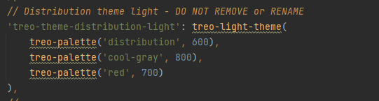

## Order Module Integration

### PrimeNg Component

In the distribution app a few PrimeNg modules were added:

- Table
- Select
- Calendar

The customization styles for all prime modules are located in `libs/shared/styles/src/lib/primeng`

### Order Module Details

The module root directory is located in `apps/distribution-ui/src/app/modules/orders`

#### Components:

- CreateOrderComponent
- OrderDetailsComponent
- FillOrderComponent
- ValidateOrderComponent
- SearchOrdersComponent
- AddProductModalComponent
- CancelOrderModalComponent
- ServiceFeeModalComponent
- CloseOrderModalComponent
- OrderWidgetsSidebarComponent (Shared Component)

##### Fill Order

The user will be able to fill the order on the order details page

When scanning the products if one of them is unlicensed, the add medical need form will be displayed
`Note:` (The document uploader created by Rismary was moved to common library to be shared by all apps, the one in `donor-ui` will be removed after integration)

### Theme

A new color palette and theme for distribution app were added

